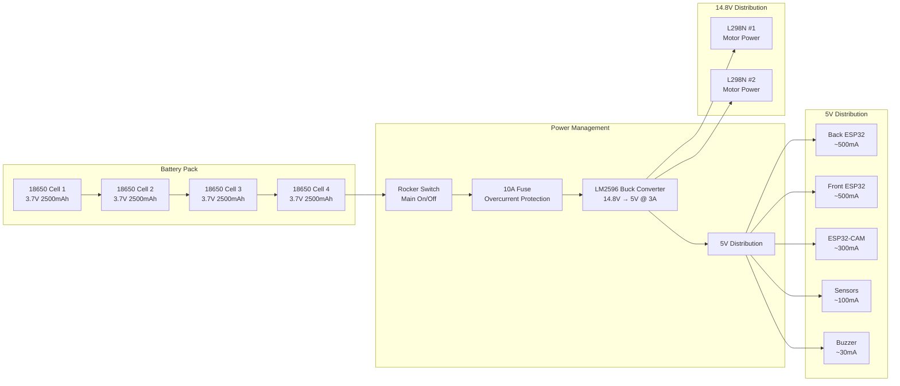
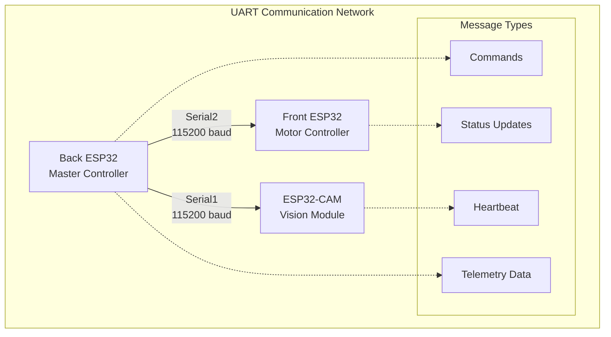

# Project Nightfall - Complete Wiring Guide

**Version:** 1.0  
**Date:** December 29, 2025  
**Project:** Project Nightfall Autonomous Rescue Robot  
**Classification:** Hardware Assembly Documentation

---

## Table of Contents

1. [Hardware Components List](#1-hardware-components-list)
2. [Detailed Pin Connection Specifications](#2-detailed-pin-connection-specifications)
3. [Power Distribution System](#3-power-distribution-system)
4. [Communication Interfaces](#4-communication-interfaces)
5. [Safety Protocols and Protection](#5-safety-protocols-and-protection)
6. [Wire Specifications and Grounding](#6-wire-specifications-and-grounding)
7. [Assembly Instructions](#7-assembly-instructions)
8. [Testing Procedures](#8-testing-procedures)
9. [Troubleshooting Guide](#9-troubleshooting-guide)
10. [Safety Considerations](#10-safety-considerations)

---

## 1. Hardware Components List

### 1.1 Core Processing Units

| Component               | Quantity | Model/Specification  | Purpose                | Unit Cost | Total Cost |
| ----------------------- | -------- | -------------------- | ---------------------- | --------- | ---------- |
| ESP32 Development Board | 2        | ESP32-WROOM-32       | Front & Rear Control   | $8-12     | $16-24     |
| ESP32-CAM Module        | 1        | AI-Thinker ESP32-CAM | Vision & ML Processing | $6-10     | $6-10      |

### 1.2 Motor Control System

| Component          | Quantity | Model/Specification | Purpose       | Unit Cost | Total Cost |
| ------------------ | -------- | ------------------- | ------------- | --------- | ---------- |
| L298N Motor Driver | 2        | L298N Dual H-Bridge | Motor Control | $3-5      | $6-10      |
| DC Gear Motor      | 4        | 12V 500 RPM         | Propulsion    | $8-15     | $32-60     |
| Robot Wheels       | 4        | 85mm Plastic Tire   | Mobility      | $5-8      | $20-32     |

### 1.3 Sensor Systems

| Component          | Quantity | Model/Specification | Purpose             | Unit Cost | Total Cost |
| ------------------ | -------- | ------------------- | ------------------- | --------- | ---------- |
| HC-SR04 Ultrasonic | 2        | HC-SR04             | Obstacle Detection  | $2-4      | $4-8       |
| MQ-2 Gas Sensor    | 1        | MQ-2 Module         | Smoke/Gas Detection | $3-6      | $3-6       |
| Active Buzzer      | 1        | 5V 70dB Continuous  | Alert System        | $2-3      | $2-3       |

### 1.4 Power Management

| Component             | Quantity | Model/Specification | Purpose            | Unit Cost | Total Cost |
| --------------------- | -------- | ------------------- | ------------------ | --------- | ---------- |
| 18650 Li-ion Battery  | 4        | 3.7V 2500mAh        | Power Source       | $4-8      | $16-32     |
| Battery Holder        | 1        | 4-chamber 18650     | Battery Housing    | $3-5      | $3-5       |
| LM2596 Buck Converter | 1        | LM2596 DC-DC        | Power Regulation   | $2-4      | $2-4       |
| Rocker Switch         | 1        | SPST On-Off         | Main Power Control | $2-3      | $2-3       |

### 1.5 Wiring and Connectors

| Component             | Quantity | Specification               | Purpose               | Unit Cost | Total Cost |
| --------------------- | -------- | --------------------------- | --------------------- | --------- | ---------- |
| Jumper Wires          | 50       | Male-to-Male/Male-to-Female | Component Connections | $0.10     | $5         |
| Solderless Breadboard | 2        | 830 Tie Points              | Prototype Connections | $2        | $4         |
| Heat Shrink Tubing    | 1m       | 2mm, 4mm, 6mm               | Wire Protection       | $2        | $2         |
| Wire Nuts/Crimp       | 20       | Various Sizes               | Secure Connections    | $0.50     | $10        |
| Cable Ties            | 50       | 4" and 8"                   | Wire Management       | $0.10     | $5         |
| Mounting Screws       | 100      | M3 x 6mm, M3 x 10mm         | Component Mounting    | $0.05     | $5         |

### 1.6 Total System Cost: **$130-215** (depending on component quality and sourcing)

---

## 2. Detailed Pin Connection Specifications

### 2.1 BACK ESP32 (Master Controller)

**Board:** ESP32-WROOM-32 Development Board  
**Power:** VIN (14.8V), GND  
**Function:** Master decision-making, WiFi AP, WebSocket server, sensor fusion

#### Pin Configuration Table

| GPIO Pin | Function       | Component Connection           | Wire Color  | Purpose                    |
| -------- | -------------- | ------------------------------ | ----------- | -------------------------- |
| **VIN**  | Power Input    | 14.8V from LM2596 Output       | Red (14.8V) | Primary Power (3.7-15V)    |
| **GND**  | Ground         | System Ground                  | Black       | Common Ground              |
| **13**   | PWM Output     | L298N ENA (Rear Left Motor)    | Orange      | Speed Control (0-255)      |
| **23**   | Digital Output | L298N IN1 (Rear Left Forward)  | Yellow      | Direction Control          |
| **22**   | Digital Output | L298N IN2 (Rear Left Reverse)  | Blue        | Direction Control          |
| **25**   | PWM Output     | L298N ENB (Rear Right Motor)   | Orange      | Speed Control (0-255)      |
| **26**   | Digital Output | L298N IN3 (Rear Right Forward) | Yellow      | Direction Control          |
| **27**   | Digital Output | L298N IN4 (Rear Right Reverse) | Blue        | Direction Control          |
| **14**   | Digital Output | Front US Trig                  | Green       | Ultrasonic Trigger         |
| **18**   | Digital Input  | Front US Echo                  | Purple      | Ultrasonic Echo Response   |
| **19**   | Digital Output | Rear US Trig                   | Green       | Ultrasonic Trigger         |
| **21**   | Digital Input  | Rear US Echo                   | Purple      | Ultrasonic Echo Response   |
| **32**   | Analog Input   | Gas Sensor Analog              | Brown       | Gas Level Reading (0-4095) |
| **4**    | Digital Output | Buzzer                         | Red         | Audio Alert (5V)           |
| **16**   | UART TX        | To Front ESP32 RX (Serial2)    | Yellow      | Master-to-Slave Comm       |
| **17**   | UART RX        | From Front ESP32 TX (Serial2)  | White       | Slave-to-Master Comm       |

#### Detailed Connection Notes

**Motor Control (Rear Motors):**

- **GPIO 13, 23, 22:** Control rear left motor through L298N
- **GPIO 25, 26, 27:** Control rear right motor through L298N
- L298N must be powered by 14.8V directly from battery

**Ultrasonic Sensors:**

- **GPIO 14, 18:** Front ultrasonic sensor (HC-SR04)
- **GPIO 19, 21:** Rear ultrasonic sensor (HC-SR04)
- Both sensors require 5V power from LM2596

**Safety Systems:**

- **GPIO 32:** MQ-2 gas sensor analog output (requires 5V)
- **GPIO 4:** Active buzzer (5V, ~30mA)

**Communication:**

- **GPIO 16, 17:** UART2 to Front ESP32 (115200 baud)

### 2.2 FRONT ESP32 (Motor Controller)

**Board:** ESP32-WROOM-32 Development Board  
**Power:** VIN (5V), GND  
**Function:** Motor execution, receives commands via UART

#### Pin Configuration Table

| GPIO Pin | Function       | Component Connection           | Wire Color | Purpose               |
| -------- | -------------- | ------------------------------ | ---------- | --------------------- |
| **VIN**  | Power Input    | 5V from LM2596 Output          | Red (5V)   | Logic Power (3.7-15V) |
| **GND**  | Ground         | System Ground                  | Black      | Common Ground         |
| **13**   | PWM Output     | L298N #1 ENA (Front Left)      | Orange     | Speed Control         |
| **23**   | Digital Output | L298N #1 IN1 (Front Left Fwd)  | Yellow     | Direction Control     |
| **22**   | Digital Output | L298N #1 IN2 (Front Left Rev)  | Blue       | Direction Control     |
| **25**   | PWM Output     | L298N #1 ENB (Front Right)     | Orange     | Speed Control         |
| **26**   | Digital Output | L298N #1 IN3 (Front Right Fwd) | Yellow     | Direction Control     |
| **27**   | Digital Output | L298N #1 IN4 (Front Right Rev) | Blue       | Direction Control     |
| **14**   | PWM Output     | L298N #2 ENA (Aux Left)        | Orange     | Speed Control         |
| **32**   | Digital Output | L298N #2 IN1 (Aux Left Fwd)    | Yellow     | Direction Control     |
| **33**   | Digital Output | L298N #2 IN2 (Aux Left Rev)    | Blue       | Direction Control     |
| **15**   | PWM Output     | L298N #2 ENB (Aux Right)       | Orange     | Speed Control         |
| **19**   | Digital Output | L298N #2 IN3 (Aux Right Fwd)   | Yellow     | Direction Control     |
| **21**   | Digital Output | L298N #2 IN4 (Aux Right Rev)   | Blue       | Direction Control     |
| **16**   | UART RX        | From Back ESP32 TX             | White      | Master-to-Slave Comm  |
| **17**   | UART TX        | To Back ESP32 RX               | Yellow     | Slave-to-Master Comm  |

#### Motor Driver Assignments

**L298N #1 (Main Front Motors):**

- GPIO 13, 23, 22: Front left motor
- GPIO 25, 26, 27: Front right motor

**L298N #2 (Auxiliary Motors):**

- GPIO 14, 32, 33: Auxiliary left motor
- GPIO 15, 19, 21: Auxiliary right motor

### 2.3 CAMERA ESP32 (Telemetry Node)

**Board:** ESP32-CAM Module  
**Power:** VIN (5V), GND  
**Function:** Vision processing, ML inference, telemetry

#### Pin Configuration Table

| GPIO Pin | Function       | Component Connection         | Wire Color | Purpose               |
| -------- | -------------- | ---------------------------- | ---------- | --------------------- |
| **VIN**  | Power Input    | 5V from LM2596 Output        | Red (5V)   | Logic Power (3.7-15V) |
| **GND**  | Ground         | System Ground                | Black      | Common Ground         |
| **4**    | Digital Output | Flash LED                    | Red        | Camera Flash          |
| **33**   | Digital Output | Status LED                   | Green      | System Status         |
| **14**   | UART TX        | To Back ESP32 RX (Serial1)   | Yellow     | Telemetry to Master   |
| **15**   | UART RX        | From Back ESP32 TX (Serial1) | White      | Commands from Master  |
| **0**    | Boot/Program   | GND during upload, floating  | -          | Programming Mode      |

#### Camera Interface (Internal)

**ESP32-CAM Built-in Camera:**

- Camera OV2640 connected to internal GPIO pins
- 640x480 resolution at 10-15 FPS
- Requires external antenna for WiFi

**Important:** GPIO0 must be connected to GND during programming, then disconnected for normal operation.

---

## 3. Power Distribution System

### 3.1 Power Architecture Overview



### 3.2 Current Requirements Analysis

| Component                   | Voltage | Current (Idle) | Current (Active) | Peak Current | Total Impact |
| --------------------------- | ------- | -------------- | ---------------- | ------------ | ------------ |
| **ESP32-WROOM-32 (x2)**     | 5V      | 80mA           | 200mA            | 300mA        | High         |
| **ESP32-CAM**               | 5V      | 120mA          | 250mA            | 400mA        | High         |
| **L298N Motor Driver**      | 14.8V   | 0mA            | 50mA             | 100mA        | Medium       |
| **DC Motors (x4)**          | 14.8V   | 0mA            | 800mA each       | 2A each      | CRITICAL     |
| **HC-SR04 Ultrasonic (x2)** | 5V      | 15mA           | 15mA             | 20mA         | Low          |
| **MQ-2 Gas Sensor**         | 5V      | 133mA          | 133mA            | 150mA        | Medium       |
| **Active Buzzer**           | 5V      | 0mA            | 30mA             | 50mA         | Low          |

### 3.3 Power Budget Summary

| Mode          | 14.8V Current | 5V Current | Total Power | Duration  |
| ------------- | ------------- | ---------- | ----------- | --------- |
| **Idle**      | 100mA         | 450mA      | 3.2W        | 24/7      |
| **Normal**    | 3.2A          | 1.3A       | 55W         | 2-3 hrs   |
| **Climbing**  | 8A            | 1.3A       | 125W        | 30 mins   |
| **Emergency** | 50mA          | 450mA      | 1.5W        | Unlimited |

**Battery Pack Specification:**

- **Configuration:** 4x 18650 Li-ion in series
- **Voltage:** 14.8V nominal (12V-16.8V range)
- **Capacity:** 2500mAh
- **Energy:** 37Wh
- **Runtime:** 2-3 hours normal operation

### 3.4 LM2596 Buck Converter Setup

**Specifications:**

- **Input Voltage:** 15-40V DC
- **Output Voltage:** 1.23-37V DC (adjustable)
- **Output Current:** 3A continuous, 4.5A peak
- **Efficiency:** ~85% typical
- **Switching Frequency:** 150kHz

**Configuration:**

- **Input:** Connect to battery positive through fuse
- **Output:** Set to 5.0V using potentiometer
- **Load:** Ensure current capacity for all 5V devices
- **Protection:** Built-in thermal and current limiting

**Setup Procedure:**

1. Set input to 14.8V
2. Adjust output to 5.0V using multimeter
3. Test under full load (3A)
4. Verify voltage stability under load

---

## 4. Communication Interfaces

### 4.1 UART Communication Network



### 4.2 UART Pin Assignments

| Connection        | Back ESP32     | Front ESP32  | ESP32-CAM    | Purpose         |
| ----------------- | -------------- | ------------ | ------------ | --------------- |
| **Master-Slave**  | GPIO 16 (TX) → | GPIO 17 (RX) | -            | Motor Commands  |
|                   | GPIO 17 (RX) ← | GPIO 16 (TX) | -            | Status Updates  |
| **Master-Vision** | GPIO 14 (TX) → | -            | GPIO 15 (RX) | Vision Commands |
|                   | GPIO 12 (RX) ← | -            | GPIO 14 (TX) | ML Results      |

### 4.3 WiFi Network Configuration

**Access Point Details:**

- **SSID:** ProjectNightfall
- **Password:** rescue2025
- **Channel:** 1 (2.4GHz)
- **Security:** WPA2
- **IP Range:** 192.168.4.0/24
- **Master IP:** 192.168.4.1

**Client Connections:**

- **ESP32-CAM:** 192.168.4.2
- **Dashboard Clients:** 192.168.4.10-192.168.4.50

### 4.4 WebSocket Communication

**WebSocket Server (Back ESP32):**

- **Port:** 8888
- **Protocol:** WebSocket
- **Message Format:** JSON
- **Update Rate:** 500ms telemetry

**WebSocket Client (ESP32-CAM):**

- **Host:** 192.168.4.1
- **Port:** 8888
- **Heartbeat Interval:** 5 seconds
- **Auto-reconnect:** 5 second intervals

---

## 5. Safety Protocols and Protection

### 5.1 Emergency Stop System

#### Hardware Emergency Stop

- **Physical Button:** Main power rocker switch
- **Response Time:** <50ms
- **Effect:** Immediate power cutoff to motors

#### Software Emergency Stop

- **Trigger Conditions:**
  - Front distance < 10cm
  - Rear distance < 10cm
  - Gas level > 600 analog value
  - Communication timeout > 5 seconds
- **Response Time:** <100ms
- **Actions:** Stop all motors, activate buzzer, broadcast alert

### 5.2 Overcurrent Protection

#### Main Power Fuse

- **Rating:** 10A fast-blow
- **Location:** Battery positive line
- **Purpose:** Protect against short circuits

#### Motor Protection

- **L298N Built-in:** 2A per channel, 4A peak
- **External Protection:** Consider adding 3A fuses per motor pair
- **Thermal Protection:** L298N has built-in thermal shutdown

### 5.3 Voltage Monitoring

#### Battery Voltage Sensing

- **Connection:** Voltage divider to ADC pin
- **Scale:** 14.8V → 3.3V (4.7kΩ + 10kΩ)
- **Thresholds:**
  - Normal: >12.5V
  - Low: 11.5-12.5V
  - Critical: <11.5V

#### 5V Rail Monitoring

- **Purpose:** Verify buck converter operation
- **Threshold:** 4.5-5.5V acceptable range
- **Action:** Emergency stop if out of range

### 5.4 Grounding Scheme

#### Star Ground Configuration

- **Central Point:** Single ground connection at battery negative
- **Ground Wires:**
  - Battery negative (16 AWG)
  - ESP32 grounds (20 AWG)
  - Sensor grounds (22 AWG)
  - Motor grounds (18 AWG)

#### EMI Considerations

- **Twisted Pairs:** For motor control signals
- **Shielded Cables:** For UART communication if needed
- **Separate Grounds:** Digital and analog grounds if possible

---

## 6. Wire Specifications and Grounding

### 6.1 Wire Gauge Requirements

| Application               | Wire Gauge | Current Capacity | Length Limit | Color Code                               |
| ------------------------- | ---------- | ---------------- | ------------ | ---------------------------------------- |
| **Battery to LM2596**     | 16 AWG     | 10A              | <1m          | Red (+) / Black (-)                      |
| **5V Distribution**       | 18 AWG     | 3A               | <2m          | Red (5V) / Black (GND)                   |
| **Motor Control Signals** | 20 AWG     | 1A               | <1m          | Orange (PWM) / Yellow (IN1) / Blue (IN2) |
| **UART Communication**    | 22 AWG     | 0.1A             | <3m          | Yellow (TX) / White (RX)                 |
| **Sensor Connections**    | 24 AWG     | 0.1A             | <1m          | Brown (Analog) / Green (Digital)         |
| **Power Ground (Main)**   | 16 AWG     | 10A              | <1m          | Black (thick)                            |

### 6.2 Connection Types and Methods

#### Soldered Connections (Recommended)

- **Tools Required:** Soldering iron, solder, flux
- **Benefits:** Most reliable, permanent connection
- **Applications:** Power distribution, critical signals

#### Screw Terminal Blocks

- **Benefits:** Easy to disconnect for maintenance
- **Applications:** Motor connections, sensor connections
- **Rating:** Verify current rating for application

#### Jumper Wires (Prototyping)

- **Benefits:** Easy to modify, no soldering required
- **Limitations:** Less reliable, higher resistance
- **Applications:** Prototyping, testing, temporary connections

### 6.3 Wire Management and Protection

#### Cable Organization

- **Cable Ties:** Secure wires every 10cm
- **Spiral Wrap:** Protect wire bundles
- **Heat Shrink Tubing:** Protect solder joints
- **Cable Grommets:** Protect wires through chassis

#### Strain Relief

- **Purpose:** Prevent wire breakage at connection points
- **Method:** Secure wires 2-3cm from terminals
- **Tools:** Cable ties, strain relief clamps

### 6.4 Grounding Implementation

#### Star Ground Point

**Location:** Central ground lug near battery negative terminal

**Connections:**

1. Battery negative (16 AWG black)
2. LM2596 ground (16 AWG black)
3. ESP32 grounds (20 AWG black)
4. L298N grounds (18 AWG black)
5. Sensor grounds (22 AWG black)

#### Ground Wire Routing

- **Minimize length:** Keep ground wires as short as possible
- **Avoid noise:** Route ground wires away from motor circuits
- **Single point:** Avoid ground loops by using star configuration

---

## 7. Assembly Instructions

### 7.1 Phase 1: Power System Assembly (30 minutes)

#### Step 1: Battery Pack Setup

1. **Install 18650 Batteries**

   - Insert 4x 18650 cells into battery holder
   - Verify polarity (+ and - signs)
   - Ensure secure fit and good contact

2. **Install Power Switch**

   - Mount rocker switch in accessible location
   - Connect battery positive to switch input
   - Verify switch operation (ON/OFF)

3. **Install Main Fuse**
   - Install 10A fuse in fuse holder
   - Connect switch output to fuse input
   - Verify fuse continuity with multimeter

#### Step 2: Voltage Regulation

1. **Mount LM2596 Converter**

   - Install in protected location away from motors
   - Ensure adequate heat dissipation
   - Secure with mounting screws

2. **Configure Output Voltage**

   - Set input to 14.8V (battery)
   - Connect multimeter to output
   - Adjust potentiometer to 5.0V
   - Verify voltage under load (3A)

3. **Install Distribution Terminals**
   - Add terminal blocks for 5V distribution
   - Label all connections clearly
   - Test each connection point

#### Step 3: Power System Verification

1. **Voltage Tests**

   - Battery voltage: 12.0-16.8V
   - LM2596 output: 4.9-5.1V
   - No short circuits (resistance > 100Ω)

2. **Current Tests**
   - Measure idle current draw
   - Verify 5V rail can supply 3A
   - Check for voltage drops under load

### 7.2 Phase 2: ESP32 Board Installation (45 minutes)

#### Step 1: Mount ESP32 Development Boards

1. **Back ESP32 (Master)**

   - Mount in central location
   - Accessible for debugging
   - Away from motor interference
   - Secure with M3 screws

2. **Front ESP32 (Motor Controller)**
   - Mount near motor drivers
   - Short wire runs to L298N modules
   - Good access for UART connections
   - Maintain separation from power circuits

#### Step 2: ESP32-CAM Setup

1. **Mounting Considerations**

   - Position for optimal camera angle
   - Ensure WiFi antenna has clear path
   - Access for programming connector
   - Protection from vibration

2. **Programming Setup**
   - Install 2.54mm header for GPIO0
   - Include reset button for recovery
   - Access to UART pins for debugging

#### Step 3: Power Distribution

1. **Connect 5V Power**

   - Route 5V from LM2596 to each ESP32
   - Use appropriate gauge wire (18 AWG)
   - Include inline fuse for each board (500mA)

2. **Connect Ground**
   - Route common ground to each ESP32
   - Use star ground configuration
   - Ensure low resistance connections

### 7.3 Phase 3: Motor Driver Installation (30 minutes)

#### Step 1: Mount L298N Drivers

1. **L298N #1 (Main Motors)**

   - Mount near front motor connections
   - Accessible for adjustment
   - Good heat dissipation
   - Protected from debris

2. **L298N #2 (Auxiliary Motors)**
   - Mount near rear motor connections
   - Maintain adequate spacing
   - Separate from L298N #1

#### Step 2: Motor Connections

1. **Connect Motor Wires**

   - Front left motor to L298N #1 OUT1/OUT2
   - Front right motor to L298N #1 OUT3/OUT4
   - Rear left motor to L298N #2 OUT1/OUT2
   - Rear right motor to L298N #2 OUT3/OUT4
   - Use matching wire colors for consistency

2. **Power Connections**
   - Connect 14.8V to L298N VIN
   - Connect 5V to L298N 5V (logic supply)
   - Connect common ground
   - Verify voltage levels

#### Step 3: Control Signal Connections

1. **Back ESP32 to L298N #1**

   - GPIO 13 → ENA
   - GPIO 23 → IN1
   - GPIO 22 → IN2
   - GPIO 25 → ENB
   - GPIO 26 → IN3
   - GPIO 27 → IN4

2. **Front ESP32 to L298N #2**
   - GPIO 13 → ENA
   - GPIO 23 → IN1
   - GPIO 22 → IN2
   - GPIO 25 → ENB
   - GPIO 26 → IN3
   - GPIO 27 → IN4

### 7.4 Phase 4: Sensor Installation (30 minutes)

#### Step 1: Ultrasonic Sensors

1. **Front Ultrasonic (HC-SR04)**

   - Mount at front of robot, 10cm above ground
   - Face forward, clear of obstructions
   - Connect VCC to 5V
   - Connect GND to common ground
   - Connect Trig to GPIO 14 (Back ESP32)
   - Connect Echo to GPIO 18 (Back ESP32)

2. **Rear Ultrasonic (HC-SR04)**
   - Mount at rear of robot, 10cm above ground
   - Face backward, clear of obstructions
   - Connect VCC to 5V
   - Connect GND to common ground
   - Connect Trig to GPIO 19 (Back ESP32)
   - Connect Echo to GPIO 21 (Back ESP32)

#### Step 2: Gas Sensor

1. **MQ-2 Gas Sensor**
   - Mount in ventilated location
   - Away from motor heat sources
   - Accessible for calibration
   - Connect VCC to 5V
   - Connect GND to common ground
   - Connect Analog to GPIO 32 (Back ESP32)
   - Connect Digital to GPIO 33 (Back ESP32)

#### Step 3: Audio Alert

1. **Active Buzzer**
   - Mount in audible location
   - Protected from weather
   - Connect positive to GPIO 4 (Back ESP32)
   - Connect negative to common ground
   - Test buzzer operation

### 7.5 Phase 5: Communication Wiring (30 minutes)

#### Step 1: UART Connections

1. **Back ESP32 to Front ESP32**

   - GPIO 16 (TX) → GPIO 17 (RX)
   - GPIO 17 (RX) → GPIO 16 (TX)
   - Connect common ground between boards
   - Use twisted pair or shielded wire

2. **Back ESP32 to ESP32-CAM**
   - GPIO 14 (TX) → GPIO 15 (RX)
   - GPIO 12 (RX) → GPIO 14 (TX)
   - Connect common ground
   - Consider twisted pair for noise reduction

#### Step 2: LED Indicators

1. **ESP32-CAM Status LEDs**
   - GPIO 4 → Flash LED
   - GPIO 33 → Status LED
   - Include current limiting resistors (220Ω)
   - Test LED operation

### 7.6 Phase 6: System Integration (15 minutes)

#### Step 1: Final Connections Review

1. **Power System**

   - Verify all power connections
   - Check fuse continuity
   - Test voltage regulation

2. **Signal Connections**
   - Verify all UART connections
   - Check sensor wiring
   - Test motor control signals

#### Step 2: Initial Power-Up

1. **Safety Checks**

   - Disconnect all motors initially
   - Verify power-on sequence
   - Check for smoke or heat
   - Measure current draw

2. **System Boot Test**
   - Power on system
   - Verify ESP32 startup
   - Check WiFi access point creation
   - Test basic communication

---

## 8. Testing Procedures

### 8.1 Power System Testing

#### Voltage Regulation Tests

1. **Battery Voltage Test**

   ```
   Expected: 12.0V (discharged) to 16.8V (fully charged)
   Test: Measure with multimeter at battery terminals
   Status: PASS if within range
   ```

2. **5V Rail Test**

   ```
   Expected: 4.9V to 5.1V under all load conditions
   Test: Measure at LM2596 output with full system load
   Status: PASS if stable within ±0.1V
   ```

3. **Current Draw Test**
   ```
   Expected: <500mA at idle, <3A under normal load
   Test: Measure current at battery and 5V rail
   Status: PASS if within specifications
   ```

#### Protection Circuit Tests

1. **Fuse Test**

   ```
   Expected: Fuse protects against shorts
   Test: Intentionally create short, verify fuse blows
   Status: PASS if fuse opens safely
   ```

2. **Overcurrent Protection**
   ```
   Expected: System shuts down at >10A
   Test: Gradually increase load, monitor current
   Status: PASS if protection activates
   ```

### 8.2 ESP32 System Testing

#### Individual Board Tests

1. **Back ESP32 (Master)**

   ```
   Test 1: Power-on sequence
   - LED indicators should illuminate
   - Serial output should show startup messages
   - WiFi access point should be visible

   Test 2: Sensor interface
   - Ultrasonic sensors respond to distance changes
   - Gas sensor provides analog readings
   - Buzzer activates on command

   Test 3: Communication
   - UART transmission to Front ESP32
   - WebSocket server responds to connections
   ```

2. **Front ESP32 (Motor Controller)**

   ```
   Test 1: UART reception
   - Receives commands from Back ESP32
   - Parses JSON motor commands correctly
   - Sends heartbeat responses

   Test 2: Motor control
   - L298N responds to control signals
   - Motor direction control works
   - PWM speed control functions
   ```

3. **ESP32-CAM (Vision)**

   ```
   Test 1: WiFi connection
   - Connects to ProjectNightfall network
   - Obtains IP address via DHCP
   - Maintains connection stability

   Test 2: WebSocket communication
   - Connects to master WebSocket server
   - Sends periodic heartbeats
   - Receives and processes commands
   ```

### 8.3 Motor System Testing

#### Individual Motor Tests

1. **Direction Control Test**

   ```
   Procedure:
   1. Send "forward" command
   2. Verify all motors rotate forward
   3. Send "reverse" command
   4. Verify all motors rotate reverse
   5. Send "stop" command
   6. Verify all motors stop

   Expected: Consistent direction across all motors
   Status: PASS if all motors respond correctly
   ```

2. **Speed Control Test**

   ```
   Procedure:
   1. Test speed range from 50 to 255 PWM
   2. Measure actual motor speed at each setting
   3. Verify proportional response
   4. Test synchronization between motors

   Expected: Linear speed response, good synchronization
   Status: PASS if speeds are proportional and consistent
   ```

#### Differential Drive Test

1. **Turning Test**

   ```
   Procedure:
   1. Send "turn left" command
   2. Left motors should stop/reverse
   3. Right motors should move forward
   4. Measure turn radius
   5. Repeat for "turn right"

   Expected: Controlled turning motion
   Status: PASS if robot turns smoothly without stalling
   ```

### 8.4 Sensor System Testing

#### Ultrasonic Sensor Tests

1. **Distance Accuracy Test**

   ```
   Procedure:
   1. Place obstacle at known distances (10, 20, 50, 100cm)
   2. Record sensor readings
   3. Compare with actual distances
   4. Calculate accuracy

   Expected: ±2cm accuracy across range
   Status: PASS if readings within tolerance
   ```

2. **Response Time Test**

   ```
   Procedure:
   1. Measure time between obstacle placement and reading
   2. Test rapid distance changes
   3. Verify sensor updates at expected rate

   Expected: <50ms response time
   Status: PASS if sensors respond promptly
   ```

#### Gas Sensor Tests

1. **Baseline Reading**

   ```
   Procedure:
   1. Power on sensor and wait 24-hour warm-up period
   2. Record baseline reading in clean air
   3. Note variation over time

   Expected: Stable baseline reading
   Status: PASS if reading stabilizes after warm-up
   ```

2. **Detection Test**

   ```
   Procedure:
   1. Expose sensor to smoke source
   2. Record analog value increase
   3. Verify digital output changes
   4. Test return to baseline

   Expected: Significant reading increase, return to baseline
   Status: PASS if sensor responds to smoke
   ```

### 8.5 Communication System Testing

#### UART Communication Tests

1. **Message Transmission Test**

   ```
   Procedure:
   1. Send test command from Back ESP32
   2. Monitor transmission on oscilloscope/logic analyzer
   3. Verify message reception at Front ESP32
   4. Check message integrity

   Expected: Clean transmission, no errors
   Status: PASS if messages transmitted correctly
   ```

2. **Latency Test**

   ```
   Procedure:
   1. Measure round-trip time for commands
   2. Test under various load conditions
   3. Verify timeout handling

   Expected: <10ms latency under normal conditions
   Status: PASS if latency acceptable
   ```

#### WiFi and WebSocket Tests

1. **Range Test**

   ```
   Procedure:
   1. Test communication at various distances
   2. Measure signal strength (RSSI)
   3. Test obstacle penetration
   4. Verify connection stability

   Expected: 25m range line-of-sight
   Status: PASS if adequate range for application
   ```

2. **Throughput Test**

   ```
   Procedure:
   1. Send high-frequency telemetry
   2. Monitor for dropped messages
   3. Measure actual update rate
   4. Test multiple simultaneous clients

   Expected: 500ms telemetry rate maintained
   Status: PASS if no significant packet loss
   ```

### 8.6 Integration Testing

#### System-Level Tests

1. **Autonomous Navigation Test**

   ```
   Procedure:
   1. Place robot in open area
   2. Enable autonomous mode
   3. Observe navigation behavior
   4. Test obstacle avoidance
   5. Verify emergency stop capability

   Expected: Smooth navigation, proper obstacle avoidance
   Status: PASS if robot navigates safely
   ```

2. **Emergency Stop Test**

   ```
   Procedure:
   1. Move robot toward obstacle
   2. Observe automatic stop at safety distance
   3. Test manual emergency stop
   4. Verify system reset capability

   Expected: Immediate stop, safe restart
   Status: PASS if safety systems function correctly
   ```

3. **Long-Duration Test**

   ```
   Procedure:
   1. Run system continuously for 2+ hours
   2. Monitor temperature, current draw
   3. Check for communication failures
   4. Verify consistent performance

   Expected: Stable operation throughout test period
   Status: PASS if no degradation observed
   ```

---

## 9. Troubleshooting Guide

### 9.1 Power System Issues

#### Problem: No Power to System

**Symptoms:**

- No LED indicators on ESP32 boards
- No voltage at LM2596 output
- Battery voltage present but no 5V

**Diagnosis Steps:**

1. Check battery voltage (should be 12-16.8V)
2. Verify rocker switch operation
3. Check main fuse continuity
4. Measure LM2596 input voltage
5. Test LM2596 output voltage

**Solutions:**

- Replace blown fuse
- Repair loose battery connections
- Adjust LM2596 potentiometer
- Replace faulty LM2596 converter

#### Problem: Low Battery Voltage

**Symptoms:**

- System operates but shuts down quickly
- Battery voltage drops under load
- Reduced motor performance

**Diagnosis Steps:**

1. Measure battery voltage under load
2. Check individual cell voltages
3. Assess battery age and cycle count
4. Test battery capacity

**Solutions:**

- Recharge batteries
- Replace aging batteries
- Check for parasitic loads
- Implement battery monitoring

#### Problem: Unstable 5V Rail

**Symptoms:**

- ESP32 boards restart randomly
- Inconsistent sensor readings
- Intermittent communication failures

**Diagnosis Steps:**

1. Measure 5V voltage with oscilloscope
2. Check for voltage ripple/noise
3. Verify load current doesn't exceed capacity
4. Test LM2596 under different loads

**Solutions:**

- Add filtering capacitors (1000µF, 0.1µF)
- Reduce load on 5V rail
- Replace faulty LM2596
- Improve heat dissipation

### 9.2 Communication Issues

#### Problem: UART Communication Failure

**Symptoms:**

- Motor commands not executed
- No heartbeat from Front ESP32
- Timeout errors in master

**Diagnosis Steps:**

1. Check physical connections
2. Verify voltage levels on UART lines
3. Monitor communication with logic analyzer
4. Test with loopback connection

**Solutions:**

- Repair broken wire connections
- Adjust UART baud rate settings
- Add pull-up resistors (4.7kΩ)
- Improve signal integrity

#### Problem: WiFi Connection Issues

**Symptoms:**

- ESP32-CAM cannot connect to network
- Weak signal strength
- Frequent disconnections

**Diagnosis Steps:**

1. Verify WiFi credentials
2. Check antenna connection
3. Measure signal strength (RSSI)
4. Test with different channels

**Solutions:**

- Improve antenna positioning
- Add external WiFi antenna
- Reduce interference sources
- Adjust WiFi channel

#### Problem: WebSocket Connection Failures

**Symptoms:**

- No telemetry from ESP32-CAM
- Connection timeout errors
- Inconsistent data updates

**Diagnosis Steps:**

1. Verify IP addresses and ports
2. Check firewall settings
3. Monitor network traffic
4. Test with simple client

**Solutions:**

- Correct IP/port configuration
- Disable firewall temporarily
- Add connection retry logic
- Simplify WebSocket implementation

### 9.3 Motor Control Issues

#### Problem: Motors Not Responding

**Symptoms:**

- No motor movement
- Strange sounds or no sound
- ESP32 indicates commands sent

**Diagnosis Steps:**

1. Check motor power connections
2. Verify L298N enable signals
3. Test motors directly with battery
4. Measure control signal voltages

**Solutions:**

- Repair power connections
- Replace faulty L298N driver
- Fix control signal wiring
- Add motor current sensing

#### Problem: Uneven Motor Speeds

**Symptoms:**

- Robot veers to one side
- Different motor speeds at same PWM
- Inconsistent performance

**Diagnosis Steps:**

1. Measure actual motor speeds
2. Check mechanical resistance
3. Verify PWM signal integrity
4. Test motor swapping

**Solutions:**

- Calibrate motor speeds in software
- Replace worn motors
- Improve mechanical design
- Add motor speed feedback

#### Problem: Motor Overheating

**Symptoms:**

- Motors become very hot
- Reduced performance over time
- L298N thermal shutdown activation

**Diagnosis Steps:**

1. Measure motor current draw
2. Check for mechanical binding
3. Verify PWM frequency
4. Assess duty cycle

**Solutions:**

- Reduce motor speed limits
- Improve mechanical design
- Add cooling fans
- Implement thermal monitoring

### 9.4 Sensor Issues

#### Problem: Ultrasonic Sensor Errors

**Symptoms:**

- Inconsistent distance readings
- "Out of range" messages
- No response from sensors

**Diagnosis Steps:**

1. Check power connections (5V)
2. Verify trig/echo signal timing
3. Test with known distances
4. Check for interference

**Solutions:**

- Repair power connections
- Adjust sensor mounting
- Add signal filtering
- Replace faulty sensors

#### Problem: Gas Sensor Sensitivity Issues

**Symptoms:**

- No response to smoke/gas
- Extremely high readings
- Slow response time

**Diagnosis Steps:**

1. Check 24-hour warm-up period
2. Verify calibration
3. Test with known gas source
4. Check for contamination

**Solutions:**

- Allow proper warm-up time
- Recalibrate sensor
- Clean sensor housing
- Replace aging sensor

### 9.5 System Integration Issues

#### Problem: Random System Resets

**Symptoms:**

- ESP32 boards restart unexpectedly
- Loss of configuration
- Intermittent operation

**Diagnosis Steps:**

1. Check power supply stability
2. Monitor for brown-out conditions
3. Verify watchdog timer settings
4. Check for electromagnetic interference

**Solutions:**

- Improve power supply filtering
- Add brown-out detection
- Disable watchdog temporarily
- Implement EMI shielding

#### Problem: Poor Performance

**Symptoms:**

- Slow response times
- High CPU usage
- Delayed sensor updates

**Diagnosis Steps:**

1. Monitor loop execution times
2. Check for blocking operations
3. Measure communication latency
4. Profile memory usage

**Solutions:**

- Optimize code execution
- Reduce communication frequency
- Implement better scheduling
- Add performance monitoring

---

## 10. Safety Considerations

### 10.1 Electrical Safety

#### High Voltage Precautions

**Warning: Battery pack produces 14.8V - treat with respect**

1. **Battery Handling**

   - Use insulated tools when working with battery connections
   - Avoid short-circuiting battery terminals
   - Store batteries in fireproof containers
   - Never reverse battery polarity

2. **Power System Safety**

   - Always disconnect power before making connections
   - Use proper fuses to prevent fires
   - Verify voltage levels before connection
   - Implement emergency power disconnect

3. **ESD Protection**
   - Use anti-static wrist straps when handling ESP32 boards
   - Work on anti-static surfaces
   - Avoid static discharge on GPIO pins
   - Handle boards by edges only

#### Current Safety

1. **Overcurrent Protection**

   - Install appropriate fuses on all power lines
   - Use current-limiting resistors on signal lines
   - Implement thermal protection on motor drivers
   - Monitor current draw continuously

2. **Heat Management**
   - Ensure adequate ventilation for power components
   - Monitor component temperatures during operation
   - Use heat sinks on power transistors
   - Implement thermal shutdown protection

### 10.2 Mechanical Safety

#### Moving Parts Hazards

1. **Motor Safety**

   - Keep hands clear of moving parts during operation
   - Use emergency stop to halt movement quickly
   - Ensure secure mounting of all components
   - Regular inspection of mechanical connections

2. **Sharp Edges**
   - Deburr all metal edges after cutting
   - Use protective covers where necessary
   - Ensure proper cable routing to prevent damage
   - Secure all mounting hardware

#### Vibration and Shock

1. **Component Security**
   - Use thread locker on all mechanical fasteners
   - Implement vibration damping where needed
   - Regular inspection of wire connections
   - Test system under expected vibration levels

### 10.3 Operational Safety

#### Emergency Procedures

1. **Emergency Stop**

   - Test emergency stop functionality regularly
   - Ensure immediate response (sub-100ms)
   - Verify motor shutdown on activation
   - Practice emergency shutdown procedures

2. **Communication Loss**
   - Implement automatic emergency stop on communication timeout
   - Test behavior when master controller fails
   - Verify backup communication methods
   - Establish recovery procedures

#### Environmental Considerations

1. **Indoor Operation**

   - Ensure adequate ventilation for gas sensors
   - Protect system from moisture
   - Consider electromagnetic interference
   - Test in representative environments

2. **Outdoor Operation**
   - Implement weatherproofing measures
   - Consider temperature extremes
   - Protect against dust and debris
   - Ensure reliable operation in various conditions

### 10.4 Testing Safety

#### Safe Testing Practices

1. **Power-Up Procedures**

   - Verify all connections before power application
   - Use current-limited power supply during testing
   - Monitor for smoke, heat, or unusual sounds
   - Have fire extinguisher readily available

2. **Motor Testing**

   - Secure robot before motor activation
   - Test motors without load first
   - Keep clear of moving parts
   - Use lowest speed settings initially

3. **Sensor Testing**
   - Calibrate sensors in safe environment
   - Use known test substances for gas sensors
   - Protect sensors from damage during testing
   - Document baseline readings

### 10.5 Maintenance Safety

#### Regular Inspection Schedule

1. **Weekly Inspections**

   - Check all wire connections for looseness
   - Verify fuse integrity
   - Test emergency stop functionality
   - Inspect for signs of overheating

2. **Monthly Inspections**

   - Deep clean all components
   - Test battery capacity
   - Calibrate sensors
   - Update software if needed

3. **Annual Inspections**
   - Complete system performance review
   - Replace aging components
   - Update safety procedures
   - Professional electrical inspection

#### Documentation Requirements

1. **Maintenance Logs**

   - Record all maintenance activities
   - Document component replacements
   - Track performance metrics
   - Note any safety incidents

2. **Training Records**
   - Ensure all operators trained on safety procedures
   - Regular safety refresher training
   - Emergency procedure drills
   - Documentation of training completion

---

## Appendices

### Appendix A: Component Datasheets

- ESP32-WROOM-32 Datasheet
- L298N Motor Driver Datasheet
- HC-SR04 Ultrasonic Sensor Datasheet
- MQ-2 Gas Sensor Datasheet
- LM2596 Buck Converter Datasheet

### Appendix B: Connection Diagrams

- Power Distribution Diagram
- Signal Connection Matrix
- Mechanical Mounting Drawings
- PCB Layout Templates

### Appendix C: Software Configuration

- PlatformIO Configuration Files
- Pin Assignment Definitions
- Communication Protocol Specifications
- Calibration Procedures

### Appendix D: Troubleshooting Quick Reference

- Symptom-to-Solution Matrix
- Test Point Locations
- Multimeter Usage Guide
- Service Contact Information

---

**Document Control:**

- **Version:** 1.0
- **Last Updated:** December 29, 2025
- **Next Review:** March 29, 2026
- **Approval:** Hardware Engineering Team

**© 2025 Project Nightfall Team**  
**Licensed under Creative Commons Attribution 4.0**
