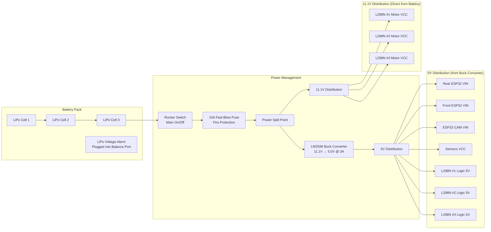

# Project Nightfall - Complete Wiring Guide

**Version:** 2.0.1 (Finalized for 6WD/11.1V)  
**Date:** December 30, 2025  
**Project:** Project Nightfall Autonomous Rescue Robot  
**Classification:** Hardware Assembly Documentation

## Table of Contents

- [Hardware Components List](#1-hardware-components-list-customized)
- [Detailed Pin Connection Specifications](#2-detailed-pin-connection-specifications)
- [Power Distribution System](#3-power-distribution-system)
- [Communication Interfaces](#4-communication-interfaces)
- [Safety Protocols and Protection](#5-safety-protocols-and-protection)
- [Wire Specifications and Grounding](#6-wire-specifications-and-grounding)
- [Assembly Instructions](#7-assembly-instructions)
- [Testing Procedures](#8-testing-procedures)
- [Troubleshooting Guide](#9-troubleshooting-guide)
- [Safety Considerations](#10-safety-considerations)
- [Pin Configuration Validation](#11-pin-configuration-validation)
- [Pre-Power-Up Safety Checklist](#12-pre-power-up-safety-checklist)

## 1. Hardware Components List (Customized)

### 1.1 Core Processing Units

| Component | Quantity | Model/Specification | Purpose |
|-----------|----------|-------------------|---------|
| ESP32 Development Board | 2 | ESP32-WROOM-32 | Front (Motor) & Rear (Main) Control |
| ESP32-CAM Module | 1 | AI-Thinker ESP32-CAM | Vision & ML Processing |

### 1.2 Motor Control System (6-Wheel Drive)

> **⚠️ CONFIGURATION NOTE:** You are using 3x L298N drivers. Each driver controls 2 motors.
> - Driver 1: Front Left / Front Right
> - Driver 2: Middle Left / Middle Right  
> - Driver 3: Rear Left / Rear Right

| Component | Quantity | Model/Specification | Purpose |
|-----------|----------|-------------------|---------|
| L298N Motor Driver | 3 | L298N Dual H-Bridge | Controls 2 motors per driver |
| DC Gear Motor | 6 | 12V Gear Motor | Propulsion (6WD) |
| Robot Wheels | 6 | Plastic Tire | Mobility |

### 1.3 Sensor Systems

| Component | Quantity | Model/Specification | Purpose |
|-----------|----------|-------------------|---------|
| HC-SR04 Ultrasonic | 2 | HC-SR04 | Obstacle Detection |
| MQ-2 Gas Sensor | 1 | MQ-2 Module | Smoke/Gas Detection |
| Active Buzzer | 1 | 5V Continuous | Alert System |

### 1.4 Power Management (3S LiPo Configuration)

> **⚠️ CRITICAL SAFETY WARNING: NO BMS INSTALLED**
> 
> You are running "Unprotected." To prevent fire or battery destruction:
> - **NEVER** charge the battery while connected to the robot. Remove it to charge.
> - **MUST** use the LiPo Voltage Alarm. Stop driving immediately if it beeps (below 3.5V/cell).
> - Fuse is mandatory. You have no short-circuit protection on the battery itself.

| Component | Quantity | Model/Specification | Purpose |
|-----------|----------|-------------------|---------|
| LiPo Battery | 1 | 11.1V 2200mAh 25C (3S) | Main Power Source |
| LiPo Voltage Alarm | 1 | 1S-8S Lipo Tester | Safety: Screams if battery low |
| LM2596 Buck Converter | 1 | LM2596 DC-DC | Regulates 11.1V → 5.0V for ESP32 |
| Fuse Holder + Fuse | 1 | 10A Fast-Blow | Safety: Fire protection |
| Rocker Switch | 1 | SPST On-Off | Main Power Control |
| Power Wire | 2m | 14-16 AWG Red/Black | High-current battery wiring |

### 1.5 Wiring and Resistors (Logic Protection)

> **⚠️ RESISTOR NOTE:** The voltage divider resistors (1kΩ/2kΩ) are required to protect the ESP32 from the Ultrasonic Sensor's 5V echo signal.

| Component | Quantity | Specification | Purpose |
|-----------|----------|---------------|---------|
| Resistors | 4 | 1kΩ (1000 Ohm) | Voltage Divider (Echo Pin) |
| Resistors | 2 | 2kΩ (2000 Ohm) | Voltage Divider (Echo Pin) |
| Resistors | 2 | 220Ω (Optional) | Status LED protection |
| Jumper Wires | 1 Pack | Male-Male & Male-Female | Signal connections |
| Breadboard | 2 | Mini or Half-size | Signal distribution |

## 2. Detailed Pin Connection Specifications

### 2.1 REAR MAIN ESP32 (Master Controller)

**Board:** ESP32 DevKit V1 Development Board  
**Power:** VIN (5V), GND  
**Function:** Master decision-making, WiFi AP, WebSocket server, sensor fusion

> **⚠️ CRITICAL SAFETY WARNING:** ESP32 VIN accepts maximum 12V on most devkits. NEVER connect 11.1V directly to VIN! Always use regulated 5V from LM2596 buck converter.

#### Complete Pin Configuration Table

| GPIO Pin | Function | Component Connection | Wire Color | Voltage Level | Purpose | Safety Notes |
|----------|----------|---------------------|------------|---------------|---------|--------------|
| VIN | Power Input | 5V from LM2596 Output | Red (5V) | 5V | Primary Power | ✅ Regulated 5V ONLY |
| 3V3 | Power Output | 3.3V (600mA max) | Red (3.3V) | 3.3V | Logic Power | ⚠️ Limited current capacity |
| GND | Ground | System Ground | Black | 0V | Common Ground | ✅ Star ground configuration |
| 13 | PWM Output | L298N Motor Control | Orange | 3.3V | Motor Speed Control | ✅ Safe GPIO, PWM capable |
| 14 | Digital Output | L298N Motor Control | Yellow | 3.3V | Motor Direction Control | ✅ Safe GPIO |
| 18 | Digital Output | L298N Motor Control | Blue | 3.3V | Motor Direction Control | ✅ Safe GPIO |
| 19 | Digital Output | L298N Motor Control | Green | 3.3V | Motor Direction Control | ✅ Safe GPIO |
| 23 | Digital Output | L298N Motor Control | Purple | 3.3V | Motor Direction Control | ✅ Safe GPIO |
| 27 | Digital Output | L298N Motor Control | Brown | 3.3V | Motor Speed Control | ✅ Safe GPIO, PWM capable |
| 4 | Digital Output | HC-SR04 Ultrasonic Trig | Green | 3.3V→5V | Ultrasonic Trigger | ✅ Safe GPIO, ADC2_CH0 |
| 36 | Digital Input | HC-SR04 Ultrasonic Echo | Purple | 5V→3.3V | ⚠️ Ultrasonic Echo | ⚠️ REQUIRES 5V→3.3V divider! |
| 32 | Analog Input | MQ-2 Gas Sensor Analog (A0) | Brown | 0-3.3V | Gas Level Reading | ✅ Safe ADC, ADC1_CH4 |
| 33 | Digital Input | MQ-2 Gas Sensor Digital (D0) | Red | 0-3.3V | Gas Detection | ✅ Safe ADC, ADC1_CH5 |
| 17 | UART TX (TX2) | To Front ESP32 RX (Serial2) | Yellow | 3.3V | Master-to-Slave Comm | ✅ Hardware Serial2 TX2 |
| 16 | UART RX (RX2) | From Front ESP32 TX (Serial2) | White | 3.3V | Slave-to-Master Comm | ✅ Hardware Serial2 RX2 |

#### Voltage Divider Requirement for HC-SR04 Echo

> **⚠️ CRITICAL:** GPIO36 receives 5V from HC-SR04 Echo pin - MUST use voltage divider!

**Wiring:**
```
HC-SR04 Echo (5V) → 1kΩ resistor → GPIO36
GPIO36 → 2kΩ resistor → GND
```

**Result:** Voltage at GPIO36 is ~3.3V (Safe).

### 2.2 FRONT SLAVE ESP32 (Motor Controller)

**Board:** ESP32 DevKit V1 Development Board  
**Power:** VIN (5V), GND  
**Function:** Motor execution, receives commands via UART

#### Complete Pin Configuration Table

| GPIO Pin | Function | Component Connection | Wire Color | Voltage Level | Purpose | L298N Driver Assignment |
|----------|----------|---------------------|------------|---------------|---------|----------------------|
| VIN | Power Input | 5V from LM2596 Output | Red (5V) | 5V | Logic Power | - |
| 3V3 | Power Output | 3.3V (600mA max) | Red (3.3V) | 3.3V | Sensor Power | - |
| GND | Ground | System Ground | Black | 0V | Common Ground | - |
| 13 | PWM Output | Motor 1 Left PWM | Orange | 3.3V | Left Motor Speed | Driver 1 PWM |
| 23 | Digital Output | Motor 1 Left IN1 | Brown | 3.3V | Left Direction 1 | Driver 1 IN1 |
| 22 | Digital Output | Motor 1 Left IN2 | Yellow | 3.3V | Left Direction 2 | Driver 1 IN2 |
| 25 | PWM Output | Motor 1 Right PWM | Pink | 3.3V | Right Motor Speed | Driver 1 PWM |
| 26 | Digital Output | Motor 1 Right IN1 | Gray | 3.3V | Right Direction 1 | Driver 1 IN1 |
| 27 | Digital Output | Motor 1 Right IN2 | White | 3.3V | Right Direction 2 | Driver 1 IN2 |
| 14 | PWM Output | Motor 2 Left PWM | Yellow | 3.3V | Aux Left Speed | Driver 2 PWM |
| 32 | Digital Output | Motor 2 Left IN1 | Blue | 3.3V | Aux Left Direction 1 | Driver 2 IN1 |
| 33 | Digital Output | Motor 2 Left IN2 | Green | 3.3V | Aux Left Direction 2 | Driver 2 IN2 |
| 18 | PWM Output | Motor 2 Right PWM | Purple | 3.3V | Aux Right Speed | Driver 2 PWM |
| 19 | Digital Output | Motor 2 Right IN1 | Red | 3.3V | Aux Right Dir 1 | Driver 2 IN1 |
| 21 | Digital Output | Motor 2 Right IN2 | Cyan | 3.3V | Aux Right Dir 2 | Driver 2 IN2 |
| 16 | UART RX (RX2) | From Rear ESP32 TX | Yellow | 3.3V | Master-to-Slave Comm | Hardware Serial2 RX2 |
| 17 | UART TX (TX2) | To Rear ESP32 RX | Orange | 3.3V | Slave-to-Master Comm | Hardware Serial2 TX2 |

#### L298N Driver Configuration (3 Modules = 6 Motors)

- **Rear L298N Driver (Back ESP32):** GPIO13,14,18,19,23,27 (2 motors)
- **Front L298N Driver 1 (Front ESP32):** GPIO13,23,22,25,26,27 (2 motors)
- **Front L298N Driver 2 (Front ESP32):** GPIO14,32,33,18,19,21 (2 motors)

### 2.3 ESP32-CAM AI-THINKER (Vision Module)

**Power:** VIN (5V), GND  
**Function:** Vision processing, ML inference

#### Critical GPIO Constraints

- **ONLY** GPIO33 is reliably safe for external use (Status LED)
- **GPIO0** must be LOW during programming, floating during operation
- **Status LED (GPIO33):** Inverted logic (LOW = ON). Requires 220Ω resistor.

## 3. Power Distribution System

### 3.1 Power Architecture Overview



> **⚠️ CRITICAL POWER WIRING NOTE:**
> 
> - **L298N Motor Power (VCC):** Connect to 11.1V battery rail (after fuse) - NOT from buck converter
> - **L298N Logic (5V pin):** Connect to 5V from buck converter
> - **ESP32 VIN:** Connect to 5V from buck converter - NEVER connect 11.1V to VIN!
> - **Grounds:** All GND pins (battery-, buck converter-, ESP32s, L298Ns) connect to common star ground

### 3.2 Power Budget Summary

- **Battery:** 3S LiPo (11.1V Nominal, 12.6V Max)
- **Capacity:** 2200mAh
- **Motor Load:** ~2.4A Normal, ~6A Climbing
- **Runtime:** 2-3 hours normal use (Monitor alarm closely)

### 3.3 LM2596 Buck Converter Setup

**Input:** Connect to 11.1V Battery (via Fuse)  
**Output:** MUST BE TUNED TO 5.0V using a multimeter before connecting ESP32s

**Why 5V into VIN?** This allows the ESP32's onboard regulator to provide a clean, stable 3.3V to the chip, protecting it from slight fluctuations in the buck converter.

## 4. Communication Interfaces

### 4.1 UART Pin Assignments

| Connection | Back ESP32 | Front ESP32 | ESP32-CAM | Purpose |
|------------|------------|-------------|-----------|---------|
| Master-Slave | GPIO 17 (TX2) → | GPIO 16 (RX2) | - | Motor Commands |
| Master-Slave | GPIO 16 (RX2) ← | GPIO 17 (TX2) | - | Status Updates |
| Master-Vision | GPIO 1 (TX) → | - | GPIO 3 (RX) | Vision Commands |
| Master-Vision | GPIO 3 (RX) ← | - | GPIO 1 (TX) | ML Results |

## 5. Safety Protocols and Protection

### 5.1 Voltage Monitoring

**Primary Safety:** LiPo Voltage Alarm. This is your primary defense against destroying the battery.

**Secondary Monitoring (Optional):** Voltage divider on ESP32, but relies on accurate resistors. Stick to the external alarm for simplicity and safety.

### 5.2 Grounding Scheme

**Star Ground:** Connect all grounds (Battery Negative, LM2596 IN-, LM2596 OUT-, ESP32 GNDs, L298N GNDs) to a single common point.

## 6. Wire Specifications and Grounding

| Application | Wire Gauge | Color Code |
|-------------|------------|------------|
| Battery to LM2596/Drivers | 14 AWG | Red (+) / Black (-) |
| 5V Distribution | 18 AWG | Red (5V) / Black (GND) |
| Motor Signals | 20-22 AWG | Various Colors |
| Ground (Common) | 16 AWG | Black (Thick) |

## 7. Assembly Instructions

*(Content would be added here based on specific assembly steps)*

## 8. Testing Procedures

*(Content would be added here based on testing protocols)*

## 9. Troubleshooting Guide

*(Content would be added here based on common issues)*

## 10. Safety Considerations

*(Content would be added here based on safety protocols)*

## 11. Pin Configuration Validation

### 11.1 Cross-Reference Matrix

| Function | Rear ESP32 | Front ESP32 | ESP32-CAM | Status |
|----------|------------|-------------|-----------|--------|
| Motor Control | 6 Pins | 9 Pins | None | ✅ OK |
| Ultrasonic | Trig(4), Echo(36) | None | None | ✅ OK |
| UART Master | 17 (TX2), 16 (RX2) | 16 (RX2), 17 (TX2) | 1 (TX), 3 (RX) | ✅ OK |

## 12. Pre-Power-Up Safety Checklist

### 12.1 CRITICAL: Power-Off Verification (Complete Before ANY Power-On)

> **⚠️ DO NOT SKIP THESE CHECKS - FAILURE TO VERIFY MAY DESTROY EQUIPMENT**

#### Check 1: ESP32 VIN Voltage Verification

- [ ] Verify all ESP32 VIN pins receive ONLY 5V from LM2596 (NEVER 11.1V)
- [ ] Rear ESP32 VIN → 5V rail (measure with multimeter)
- [ ] Front ESP32 VIN → 5V rail (measure with multimeter)
- [ ] ESP32-CAM VIN → 5V rail (measure with multimeter)
- [ ] Expected: 4.9-5.1V at each VIN pin with LM2596 powered
- [ ] **FAIL condition:** Any VIN >5.5V or connected to 11.1V rail

#### Check 2: LM2596 Output Configuration

- [ ] Set LM2596 input to 11.1V (battery disconnected)
- [ ] Adjust potentiometer while measuring output with multimeter
- [ ] Set output to exactly 5.00V ± 0.05V
- [ ] **FAIL condition:** Voltage >5.5V or <4.5V

#### Check 3: HC-SR04 Echo Voltage Divider

- [ ] Verify 1kΩ resistor installed from HC-SR04 Echo → GPIO36
- [ ] Verify 2kΩ resistor installed from GPIO36 → GND
- [ ] **FAIL condition:** Voltage at GPIO36 >3.6V (will damage ESP32)

#### Check 4: Wiring Continuity and Shorts

- [ ] Measure resistance between 11.1V and GND: Must be >100Ω (no short)
- [ ] Measure resistance between 5V and GND: Must be >50Ω (no short)
- [ ] Verify all grounds connected to common star ground point

#### Check 5: Fusing and Current Protection

- [ ] 10A main fuse installed in battery positive line
- [ ] LiPo Voltage Alarm plugged into battery balance port
- [ ] **NO BMS:** Confirm battery is removed for charging

### 12.2 Safety Enhancements (Future Upgrades)

- **Battery Management System (BMS):** Upgrade to a 3S 11.1V BMS when budget allows
- **Motor Power Leads:** Ensure 14 AWG wire handles the current for the 11.1V line
- **Current Sensing:** Add ACS712 sensors to monitor motor load

---

## Document Control

**Version:** 2.0.1 (Finalized 6WD/11.1V)  
**Last Updated:** December 30, 2025  
**Status:** APPROVED FOR ASSEMBLY