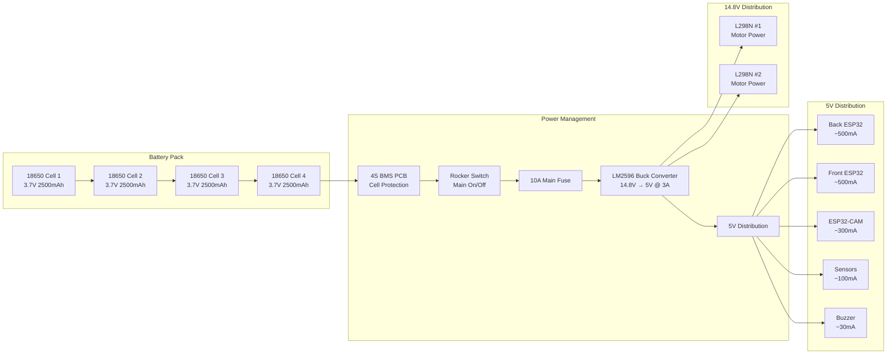
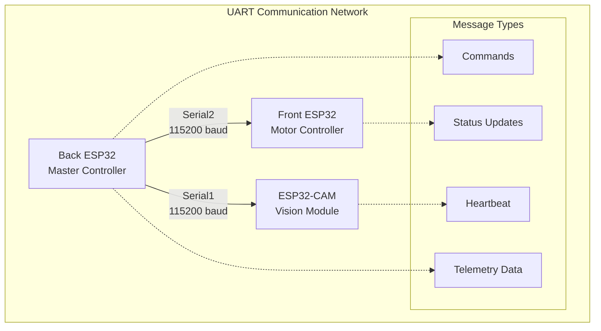

# Project Nightfall - Complete Wiring Guide

**Version:** 2.0.0  
**Date:** December 30, 2025  
**Project:** Project Nightfall Autonomous Rescue Robot  
**Classification:** Hardware Assembly Documentation

---

## Table of Contents

1. [Hardware Components List](#1-hardware-components-list)
2. [Detailed Pin Connection Specifications](#2-detailed-pin-connection-specifications)
3. [Power Distribution System](#3-power-distribution-system)
4. [Communication Interfaces](#4-communication-interfaces)
5. [Safety Protocols and Protection](#5-safety-protocols-and-protection)
6. [Wire Specifications and Grounding](#6-wire-specifications-and-grounding)
7. [Assembly Instructions](#7-assembly-instructions)
8. [Testing Procedures](#8-testing-procedures)
9. [Troubleshooting Guide](#9-troubleshooting-guide)
10. [Safety Considerations](#10-safety-considerations)

---

## 1. Hardware Components List

### 1.1 Core Processing Units

| Component               | Quantity | Model/Specification  | Purpose                | Unit Cost | Total Cost |
| ----------------------- | -------- | -------------------- | ---------------------- | --------- | ---------- |
| ESP32 Development Board | 2        | ESP32-WROOM-32       | Front & Rear Control   | $8-12     | $16-24     |
| ESP32-CAM Module        | 1        | AI-Thinker ESP32-CAM | Vision & ML Processing | $6-10     | $6-10      |

### 1.2 Motor Control System

⚠️ **MOTOR DRIVER WARNING:** L298N modules are inefficient (40% power loss) and may overheat with motors drawing 2-4A peaks. **Recommended alternatives:** VNH5019 (30A), BTS7960 (43A), or dual TB6612FNG (3.2A continuous) for better efficiency, thermal protection, and current handling.

| Component          | Quantity | Model/Specification | Purpose       | Unit Cost | Total Cost |
| ------------------ | -------- | ------------------- | ------------- | --------- | ---------- |
| L298N Motor Driver | 3        | L298N Dual H-Bridge | Motor Control | $3-5      | $9-15      |
| DC Gear Motor      | 4        | 12V 500 RPM         | Propulsion    | $8-15     | $32-60     |
| Robot Wheels       | 4        | 85mm Plastic Tire   | Mobility      | $5-8      | $20-32     |

### 1.3 Sensor Systems

| Component          | Quantity | Model/Specification | Purpose             | Unit Cost | Total Cost |
| ------------------ | -------- | ------------------- | ------------------- | --------- | ---------- |
| HC-SR04 Ultrasonic | 2        | HC-SR04             | Obstacle Detection  | $2-4      | $4-8       |
| MQ-2 Gas Sensor    | 1        | MQ-2 Module         | Smoke/Gas Detection | $3-6      | $3-6       |
| Active Buzzer      | 1        | 5V 70dB Continuous  | Alert System        | $2-3      | $2-3       |

### 1.4 Power Management

⚠️ **CRITICAL:** 4S Li-ion pack (14.8V) requires BMS for cell balancing, overcharge/overdischarge protection, and safe operation.

| Component             | Quantity | Model/Specification       | Purpose                | Unit Cost | Total Cost |
| --------------------- | -------- | ------------------------- | ---------------------- | --------- | ---------- |
| 18650 Li-ion Battery  | 4        | 3.7V 2500mAh              | Power Source           | $4-8      | $16-32     |
| 4S BMS Protection PCB | 1        | 4S 14.8V 10-20A BMS       | Battery Protection     | $5-10     | $5-10      |
| Battery Holder        | 1        | 4-chamber 18650           | Battery Housing        | $3-5      | $3-5       |
| LM2596 Buck Converter | 1        | LM2596 DC-DC              | Power Regulation       | $2-4      | $2-4       |
| Fast-Blow Fuse        | 1        | 10A main + 3-5A per motor | Overcurrent Protection | $1-2      | $3-8       |
| Rocker Switch         | 1        | SPST On-Off               | Main Power Control     | $2-3      | $2-3       |

### 1.5 Wiring and Connectors

| Component             | Quantity | Specification               | Purpose               | Unit Cost | Total Cost |
| --------------------- | -------- | --------------------------- | --------------------- | --------- | ---------- |
| Jumper Wires          | 50       | Male-to-Male/Male-to-Female | Component Connections | $0.10     | $5         |
| Solderless Breadboard | 2        | 830 Tie Points              | Prototype Connections | $2        | $4         |
| Heat Shrink Tubing    | 1m       | 2mm, 4mm, 6mm               | Wire Protection       | $2        | $2         |
| Wire Nuts/Crimp       | 20       | Various Sizes               | Secure Connections    | $0.50     | $10        |
| Cable Ties            | 50       | 4" and 8"                   | Wire Management       | $0.10     | $5         |
| Mounting Screws       | 100      | M3 x 6mm, M3 x 10mm         | Component Mounting    | $0.05     | $5         |

### 1.6 Total System Cost: **$130-215** (depending on component quality and sourcing)

---

## 2. Detailed Pin Connection Specifications

### 2.1 REAR MAIN ESP32 (Master Controller)

**Board:** ESP32 DevKit V1 Development Board  
**Power:** VIN (5V), GND  
**Function:** Master decision-making, WiFi AP, WebSocket server, sensor fusion
**Version:** 2.0.0 - Updated per pin.md specifications

⚠️ **CRITICAL SAFETY WARNING:** ESP32 VIN accepts maximum 12V on most devkits. **NEVER connect 14.8V directly to VIN!** Always use regulated 5V from LM2596 buck converter.

#### Complete Pin Configuration Table

| GPIO Pin | Function       | Component Connection          | Wire Color | Voltage Level | Purpose                 | Safety Notes                 |
| -------- | -------------- | ----------------------------- | ---------- | ------------- | ----------------------- | ---------------------------- |
| **VIN**  | Power Input    | 5V from LM2596 Output         | Red (5V)   | 5V            | Primary Power           | ✅ Regulated 5V ONLY         |
| **3V3**  | Power Output   | 3.3V (600mA max)              | Red (3.3V) | 3.3V          | Logic Power             | ⚠️ Limited current capacity  |
| **GND**  | Ground         | System Ground                 | Black      | 0V            | Common Ground           | ✅ Star ground configuration |
| **13**   | PWM Output     | L298N Motor Control           | Orange     | 3.3V          | Motor Speed Control     | ✅ Safe GPIO, PWM capable    |
| **14**   | Digital Output | L298N Motor Control           | Yellow     | 3.3V          | Motor Direction Control | ✅ Safe GPIO                 |
| **18**   | Digital Output | L298N Motor Control           | Blue       | 3.3V          | Motor Direction Control | ✅ Safe GPIO                 |
| **19**   | Digital Output | L298N Motor Control           | Green      | 3.3V          | Motor Direction Control | ✅ Safe GPIO                 |
| **23**   | Digital Output | L298N Motor Control           | Purple     | 3.3V          | Motor Direction Control | ✅ Safe GPIO                 |
| **27**   | Digital Output | L298N Motor Control           | Brown      | 3.3V          | Motor Speed Control     | ✅ Safe GPIO, PWM capable    |
| **4**    | Digital Output | HC-SR04 Ultrasonic Trig       | Green      | 3.3V→5V       | Ultrasonic Trigger      | ✅ Safe GPIO, ADC2_CH0       |
| **36**   | Digital Input  | HC-SR04 Ultrasonic Echo       | Purple     | 5V→3.3V⚠️     | Ultrasonic Echo         | ⚠️ REQUIRES 5V→3.3V divider! |
| **32**   | Analog Input   | MQ-2 Gas Sensor Analog (A0)   | Brown      | 0-3.3V        | Gas Level Reading       | ✅ Safe ADC, ADC1_CH4        |
| **33**   | Digital Input  | MQ-2 Gas Sensor Digital (D0)  | Red        | 0-3.3V        | Gas Detection           | ✅ Safe ADC, ADC1_CH5        |
| **17**   | UART TX (TX2)  | To Front ESP32 RX (Serial2)   | Yellow     | 3.3V          | Master-to-Slave Comm    | ✅ Hardware Serial2 TX2      |
| **16**   | UART RX (RX2)  | From Front ESP32 TX (Serial2) | White      | 3.3V          | Slave-to-Master Comm    | ✅ Hardware Serial2 RX2      |

#### Voltage Divider Requirement for HC-SR04 Echo

**⚠️ CRITICAL:** GPIO36 receives 5V from HC-SR04 Echo pin - **MUST use voltage divider!**

**Recommended Voltage Divider:**

```
HC-SR04 Echo (5V) → [1kΩ resistor] → GPIO36 → [2kΩ resistor] → GND
                         ↓
                   Voltage at GPIO36 = 3.33V ✓
```

**Alternative:** 10kΩ + 20kΩ for lower current draw

**Wiring:**

- HC-SR04 Echo → 1kΩ resistor → GPIO36
- GPIO36 → 2kΩ resistor → GND
- Verify voltage at GPIO36 is ≤3.3V

#### Detailed Connection Notes - Updated per pin.md

**Motor Control (L298N Driver):**

- **GPIO 13,14,18,19,23,27:** Six motor control pins for single L298N driver
- Motors powered by 14.8V directly from battery
- PWM speed control on GPIO13 and GPIO27
- Direction control on GPIO14,18,19,23

**HC-SR04 Ultrasonic Sensor:**

- **GPIO 4:** Ultrasonic Trigger (5V output from ESP32)
- **GPIO 36:** Ultrasonic Echo (5V input - **REQUIRES 5V→3.3V voltage divider!**)
- Sensor powered by 5V from LM2596
- **Critical:** Use voltage divider on Echo pin to protect ESP32

**MQ-2 Gas Sensor:**

- **GPIO 32:** Gas sensor analog output (A0 - 0-3.3V)
- **GPIO 33:** Gas sensor digital output (D0/Buzzer)
- Sensor powered by 3.3V from ESP32
- Buzzer function integrated on GPIO33

**UART Communication:**

- **GPIO 17 (TX2), GPIO 16 (RX2):** Hardware Serial2 to Front ESP32 (115200 baud)
- Cross-connection: Rear GPIO17 (TX2) ↔ Front GPIO16 (RX2), Rear GPIO16 (RX2) ↔ Front GPIO17 (TX2)
- ⚠️ Serial2 uses **fixed hardware pins** GPIO16/17 on ESP32 - cannot be remapped

### 2.2 FRONT SLAVE ESP32 (Motor Controller)

**Board:** ESP32 DevKit V1 Development Board  
**Power:** VIN (5V), GND  
**Function:** Motor execution, receives commands via UART
**Version:** 2.0.0 - Updated per pin.md specifications

#### Complete Pin Configuration Table

| GPIO Pin | Function       | Component Connection  | Wire Color | Voltage Level | Purpose              | L298N Driver Assignment |
| -------- | -------------- | --------------------- | ---------- | ------------- | -------------------- | ----------------------- |
| **VIN**  | Power Input    | 5V from LM2596 Output | Red (5V)   | 5V            | Logic Power          | -                       |
| **3V3**  | Power Output   | 3.3V (600mA max)      | Red (3.3V) | 3.3V          | Sensor Power         | -                       |
| **GND**  | Ground         | System Ground         | Black      | 0V            | Common Ground        | -                       |
| **13**   | PWM Output     | Motor 1 Left PWM      | Orange     | 3.3V          | Left Motor Speed     | Driver 1 PWM            |
| **23**   | Digital Output | Motor 1 Left IN1      | Brown      | 3.3V          | Left Direction 1     | Driver 1 IN1            |
| **22**   | Digital Output | Motor 1 Left IN2      | Yellow     | 3.3V          | Left Direction 2     | Driver 1 IN2            |
| **25**   | PWM Output     | Motor 1 Right PWM     | Pink       | 3.3V          | Right Motor Speed    | Driver 1 PWM            |
| **26**   | Digital Output | Motor 1 Right IN1     | Gray       | 3.3V          | Right Direction 1    | Driver 1 IN1            |
| **27**   | Digital Output | Motor 1 Right IN2     | White      | 3.3V          | Right Direction 2    | Driver 1 IN2            |
| **14**   | PWM Output     | Motor 2 Left PWM      | Yellow     | 3.3V          | Aux Left Speed       | Driver 2 PWM            |
| **32**   | Digital Output | Motor 2 Left IN1      | Blue       | 3.3V          | Aux Left Direction 1 | Driver 2 IN1            |
| **33**   | Digital Output | Motor 2 Left IN2      | Green      | 3.3V          | Aux Left Direction 2 | Driver 2 IN2            |
| **18**   | PWM Output     | Motor 2 Right PWM     | Purple     | 3.3V          | Aux Right Speed      | Driver 2 PWM ✅ Safe    |
| **19**   | Digital Output | Motor 2 Right IN1     | Red        | 3.3V          | Aux Right Dir 1      | Driver 2 IN1            |
| **21**   | Digital Output | Motor 2 Right IN2     | Cyan       | 3.3V          | Aux Right Dir 2      | Driver 2 IN2            |
| **16**   | UART RX (RX2)  | From Rear ESP32 TX    | Yellow     | 3.3V          | Master-to-Slave Comm | Hardware Serial2 RX2    |
| **17**   | UART TX (TX2)  | To Rear ESP32 RX      | Orange     | 3.3V          | Slave-to-Master Comm | Hardware Serial2 TX2    |

#### L298N Driver Configuration (3 Modules = 6 Motors)

**Rear L298N Driver (Back ESP32 - main_rear.cpp, 2 motors):**

- GPIO13 → Motor PWM (ENA)
- GPIO14 → Motor IN1
- GPIO18 → Motor IN2
- GPIO19 → Motor IN3
- GPIO23 → Motor IN4
- GPIO27 → Motor PWM (ENB)

**Front L298N Driver 1 (Main Motors - main_front.cpp):**

- GPIO13 → Left Motor PWM (MOTOR1_LEFT_PWM)
- GPIO23 → Left Motor IN1 (MOTOR1_LEFT_IN1)
- GPIO22 → Left Motor IN2 (MOTOR1_LEFT_IN2)
- GPIO25 → Right Motor PWM (MOTOR1_RIGHT_PWM)
- GPIO26 → Right Motor IN1 (MOTOR1_RIGHT_IN1)
- GPIO27 → Right Motor IN2 (MOTOR1_RIGHT_IN2)

**Front L298N Driver 2 (Auxiliary Motors - main_front.cpp):**

- GPIO14 → Left Motor PWM (MOTOR2_LEFT_PWM)
- GPIO32 → Left Motor IN1 (MOTOR2_LEFT_IN1)
- GPIO33 → Left Motor IN2 (MOTOR2_LEFT_IN2)
- GPIO18 → Right Motor PWM (MOTOR2_RIGHT_PWM) ✅ Safe GPIO
- GPIO19 → Right Motor IN1 (MOTOR2_RIGHT_IN1)
- GPIO21 → Right Motor IN2 (MOTOR2_RIGHT_IN2)

**⚠️ IMPORTANT PIN NOTES:**

- **GPIO22 used for Motor 1 IN2** - This is safe since Serial2 actually uses GPIO16/17 (hardware fixed)
- **All pins verified safe** according to pin.md - no boot strapping conflicts
- **GPIO15, GPIO5, GPIO12, GPIO2, GPIO0** avoided (boot strap pins)

**Motor Power:** All three L298N drivers powered from the 14.8V battery pack (logic 5V from LM2596)

#### Motor Driver Assignments - Updated per pin.md

**L298N Motor Drivers (3x modules for 6 motors):**

- **Rear Driver (Back ESP32):** GPIO13,14,18,19,23,27 (2 motors)
- **Front Driver 1 (Front ESP32):** GPIO13,23,22,25,26,27 (2 motors)
- **Front Driver 2 (Front ESP32):** GPIO14,32,33,18,19,21 (2 motors)
- Total: 18 motor control pins across 3 L298N drivers (board-local, no conflicts)

### 2.3 ESP32-CAM AI-THINKER (Vision Module)

**Board:** ESP32-CAM AI-Thinker Module  
**Power:** VIN (5V), GND  
**Function:** Vision processing, ML inference, telemetry
**Version:** 2.0.0 - Updated per pin.md specifications

#### Critical GPIO Constraints

⚠️ **IMPORTANT:** ESP32-CAM has severe GPIO limitations:

- **ONLY GPIO33** is reliably safe for external use
- All other GPIOs are used by camera or SD card interface
- **GPIO0** must be LOW during programming, floating during operation

#### Complete Pin Configuration Table

| GPIO Pin | Function       | Component Connection        | Wire Color | Voltage Level | Purpose             | Constraints                 |
| -------- | -------------- | --------------------------- | ---------- | ------------- | ------------------- | --------------------------- |
| **VIN**  | Power Input    | 5V from LM2596 Output       | Red (5V)   | 5V            | Logic Power         | ✅ Accepts 5V on VIN/USB    |
| **3V3**  | Power Output   | 3.3V (limited)              | Red (3.3V) | 3.3V          | Limited 3.3V output | ⚠️ Very limited current     |
| **GND**  | Ground         | System Ground               | Black      | 0V            | Common Ground       | ✅ Multiple ground pins     |
| **33**   | Digital Output | Status LED (LOW=ON)         | Green      | 3.3V          | System Status       | ✅ ONLY safe external GPIO  |
| **4**    | Digital Output | Flash LED                   | Red        | 3.3V          | Camera Flash        | ⚠️ Used by camera interface |
| **0**    | Boot/Program   | GND during upload, floating | -          | -             | Programming Mode    | ⚠️ Boot strap, special use  |
| **1**    | UART TX        | Serial TX (conflicts)       | Yellow     | 3.3V          | Debug/Programming   | ❌ Conflicts with camera    |
| **3**    | UART RX        | Serial RX (conflicts)       | White      | 3.3V          | Debug/Programming   | ❌ Conflicts with camera    |

#### Status LED Configuration (GPIO33)

**Built-in Red LED on GPIO33:**

- **Logic:** LOW = LED ON, HIGH = LED OFF (inverted logic)
- **Wiring:** GPIO33 → Red LED → 220Ω resistor → GND
- **Purpose:** System status indication, heartbeat, error reporting

**LED Control Examples:**

```cpp
#define LED_ON  LOW   // Turn LED on
#define LED_OFF HIGH  // Turn LED off

// Flash pattern for status
digitalWrite(PIN_STATUS_LED, LED_ON);   // LED on
delay(100);
digitalWrite(PIN_STATUS_LED, LED_OFF);  // LED off
```

#### Camera Interface (Internal)

**Built-in OV2640 Camera:**

- Connected to internal GPIO pins (managed by ESP32-CAM library)
- Resolution: 640x480 at 10-15 FPS
- Format: JPEG compression
- Requires external antenna for stable WiFi

**SD Card Interface (1-bit mode):**

- Use `SD_MMC.begin("/sdcard", true)` for 1-bit mode
- Frees GPIO12/13 for other use
- Capacity: Up to 32GB microSD

#### Programming Requirements

**For Uploading Code:**

1. Connect GPIO0 to GND
2. Press and hold reset button
3. Upload code via Arduino IDE/PlatformIO
4. Remove GPIO0-GND connection
5. Press reset to run

**For Normal Operation:**

1. GPIO0 must be floating (disconnected)
2. Reset button to restart
3. Status LED on GPIO33 for monitoring

#### Camera Interface (Internal)

**ESP32-CAM Built-in Camera:**

- Camera OV2640 connected to internal GPIO pins
- 640x480 resolution at 10-15 FPS
- Requires external antenna for WiFi

**Important:** GPIO0 must be connected to GND during programming, then disconnected for normal operation.

---

## 3. Power Distribution System

### 3.1 Power Architecture Overview



### 3.2 Current Requirements Analysis

| Component                   | Voltage | Current (Idle) | Current (Active) | Peak Current | Total Impact |
| --------------------------- | ------- | -------------- | ---------------- | ------------ | ------------ |
| **ESP32-WROOM-32 (x2)**     | 5V      | 80mA           | 200mA            | 300mA        | High         |
| **ESP32-CAM**               | 5V      | 120mA          | 250mA            | 400mA        | High         |
| **L298N Motor Driver**      | 14.8V   | 0mA            | 50mA             | 100mA        | Medium       |
| **DC Motors (x4)**          | 14.8V   | 0mA            | 800mA each       | 2A each      | CRITICAL     |
| **HC-SR04 Ultrasonic (x2)** | 5V      | 15mA           | 15mA             | 20mA         | Low          |
| **MQ-2 Gas Sensor**         | 5V      | 133mA          | 133mA            | 150mA        | Medium       |
| **Active Buzzer**           | 5V      | 0mA            | 30mA             | 50mA         | Low          |

### 3.3 Power Budget Summary

| Mode          | 14.8V Current | 5V Current | Total Power | Duration  |
| ------------- | ------------- | ---------- | ----------- | --------- |
| **Idle**      | 100mA         | 450mA      | 3.2W        | 24/7      |
| **Normal**    | 3.2A          | 1.3A       | 55W         | 2-3 hrs   |
| **Climbing**  | 8A            | 1.3A       | 125W        | 30 mins   |
| **Emergency** | 50mA          | 450mA      | 1.5W        | Unlimited |

**Battery Pack Specification:**

- **Configuration:** 4x 18650 Li-ion in series
- **Voltage:** 14.8V nominal (12V-16.8V range)
- **Capacity:** 2500mAh
- **Energy:** 37Wh
- **Runtime:** 2-3 hours normal operation

### 3.4 LM2596 Buck Converter Setup

**Specifications:**

- **Input Voltage:** 15-40V DC
- **Output Voltage:** 1.23-37V DC (adjustable)
- **Output Current:** 3A continuous, 4.5A peak
- **Efficiency:** ~85% typical
- **Switching Frequency:** 150kHz

**Configuration:**

- **Input:** Connect to battery positive through fuse
- **Output:** Set to 5.0V using potentiometer
- **Load:** Ensure current capacity for all 5V devices
- **Protection:** Built-in thermal and current limiting

**Setup Procedure:**

1. Set input to 14.8V
2. Adjust output to 5.0V using multimeter
3. Test under full load (3A)
4. Verify voltage stability under load

---

## 4. Communication Interfaces

### 4.1 UART Communication Network



### 4.2 UART Pin Assignments

| Connection        | Back ESP32      | Front ESP32   | ESP32-CAM   | Purpose         |
| ----------------- | --------------- | ------------- | ----------- | --------------- |
| **Master-Slave**  | GPIO 17 (TX2) → | GPIO 16 (RX2) | -           | Motor Commands  |
|                   | GPIO 16 (RX2) ← | GPIO 17 (TX2) | -           | Status Updates  |
| **Master-Vision** | GPIO 1 (TX) →   | -             | GPIO 3 (RX) | Vision Commands |
|                   | GPIO 3 (RX) ←   | -             | GPIO 1 (TX) | ML Results      |

### 4.3 WiFi Network Configuration

**Access Point Details:**

- **SSID:** ProjectNightfall
- **Password:** rescue2025
- **Channel:** 1 (2.4GHz)
- **Security:** WPA2
- **IP Range:** 192.168.4.0/24
- **Master IP:** 192.168.4.1

**Client Connections:**

- **ESP32-CAM:** 192.168.4.2
- **Dashboard Clients:** 192.168.4.10-192.168.4.50

### 4.4 WebSocket Communication

**WebSocket Server (Back ESP32):**

- **Port:** 8888
- **Protocol:** WebSocket
- **Message Format:** JSON
- **Update Rate:** 500ms telemetry
- **Max Clients:** 4 simultaneous connections

**WebSocket Client (ESP32-CAM):**

- **Host:** 192.168.4.1
- **Port:** 8888
- **Heartbeat Interval:** 5 seconds
- **Auto-reconnect:** 5 second intervals

#### Enhanced Communication Protocols

**UART Master-Slave Communication (115200 baud):**

1. **Message Format:** JSON with type field
2. **Command Messages:** {"L": speed, "R": speed, "CL": speed, "CR": speed}
3. **Heartbeat Messages:** {"type": "heartbeat", "source": "front", "emergency": bool}
4. **Emergency Commands:** {"cmd": "emergency_stop"}, {"cmd": "emergency_reset"}
5. **Timeout Handling:** 1000ms for emergency stop, 3000ms for connection loss

**WiFi Access Point Configuration:**

- **SSID:** ProjectNightfall
- **Password:** rescue2025
- **Security:** WPA2-PSK
- **Channel:** Auto (2.4GHz)
- **IP Range:** 192.168.4.0/24
- **Master IP:** 192.168.4.1 (Back ESP32)
- **Client Range:** 192.168.4.2-192.168.4.254

**Implementation Steps:**

1. **Initialize UART Communication:**

   ```cpp
   Serial2.begin(115200);  // Both ESP32 boards
   ```

2. **Send Motor Commands:**

   ```cpp
   StaticJsonDocument<256> motorDoc;
   motorDoc["L"] = leftSpeed;
   motorDoc["R"] = rightSpeed;
   String command;
   serializeJson(motorDoc, command);
   Serial2.print(command);
   Serial2.print("\n");
   ```

3. **Receive Heartbeat:**

   ```cpp
   if (Serial2.available()) {
       String message = Serial2.readStringUntil('\n');
       DynamicJsonDocument doc(256);
       deserializeJson(doc, message);
       if (doc["type"] == "heartbeat") {
           // Process heartbeat
       }
   }
   ```

4. **WiFi Setup (Back ESP32):**

   ```cpp
   WiFi.softAP("ProjectNightfall", "rescue2025");
   ```

5. **WebSocket Server (Back ESP32):**
   ```cpp
   WebSocketsServer webSocketServer(8888);
   webSocketServer.begin();
   webSocketServer.onEvent(handleWebSocketEvent);
   ```

---

## 5. Safety Protocols and Protection

### 5.1 Emergency Stop System

#### Hardware Emergency Stop

- **Physical Button:** Main power rocker switch
- **Response Time:** <50ms
- **Effect:** Immediate power cutoff to motors

#### Software Emergency Stop

- **Trigger Conditions:**
  - Front distance < 10cm
  - Rear distance < 10cm
  - Gas level > 600 analog value
  - Communication timeout > 5 seconds
- **Response Time:** <100ms
- **Actions:** Stop all motors, activate buzzer, broadcast alert

### 5.2 Overcurrent Protection

#### Main Power Fuse

- **Rating:** 10A fast-blow
- **Location:** Battery positive line
- **Purpose:** Protect against short circuits

#### Motor Protection

- **L298N Built-in:** 2A per channel, 4A peak
- **External Protection:** Consider adding 3A fuses per motor pair
- **Thermal Protection:** L298N has built-in thermal shutdown

### 5.3 Voltage Monitoring

#### Battery Voltage Sensing

- **Connection:** Voltage divider to ADC pin
- **Scale:** 14.8V → 3.3V (4.7kΩ + 10kΩ)
- **Thresholds:**
  - Normal: >12.5V
  - Low: 11.5-12.5V
  - Critical: <11.5V

#### 5V Rail Monitoring

- **Purpose:** Verify buck converter operation
- **Threshold:** 4.5-5.5V acceptable range
- **Action:** Emergency stop if out of range

### 5.4 Grounding Scheme

#### Star Ground Configuration

- **Central Point:** Single ground connection at battery negative
- **Ground Wires:**
  - Battery negative (16 AWG)
  - ESP32 grounds (20 AWG)
  - Sensor grounds (22 AWG)
  - Motor grounds (18 AWG)

#### EMI Considerations

- **Twisted Pairs:** For motor control signals
- **Shielded Cables:** For UART communication if needed
- **Separate Grounds:** Digital and analog grounds if possible

---

## 6. Wire Specifications and Grounding

### 6.1 Wire Gauge Requirements

| Application               | Wire Gauge | Current Capacity | Length Limit | Color Code                               |
| ------------------------- | ---------- | ---------------- | ------------ | ---------------------------------------- |
| **Battery to LM2596**     | 14 AWG     | 13A              | <0.5m        | Red (+) / Black (-) - Short, thick       |
| **5V Distribution**       | 18 AWG     | 3A               | <2m          | Red (5V) / Black (GND)                   |
| **Motor Control Signals** | 20 AWG     | 1A               | <1m          | Orange (PWM) / Yellow (IN1) / Blue (IN2) |
| **UART Communication**    | 22 AWG     | 0.1A             | <3m          | Yellow (TX) / White (RX)                 |
| **Sensor Connections**    | 24 AWG     | 0.1A             | <1m          | Brown (Analog) / Green (Digital)         |
| **Power Ground (Main)**   | 16 AWG     | 10A              | <1m          | Black (thick)                            |

### 6.2 Connection Types and Methods

#### Soldered Connections (Recommended)

- **Tools Required:** Soldering iron, solder, flux
- **Benefits:** Most reliable, permanent connection
- **Applications:** Power distribution, critical signals

#### Screw Terminal Blocks

- **Benefits:** Easy to disconnect for maintenance
- **Applications:** Motor connections, sensor connections
- **Rating:** Verify current rating for application

#### Jumper Wires (Prototyping)

- **Benefits:** Easy to modify, no soldering required
- **Limitations:** Less reliable, higher resistance
- **Applications:** Prototyping, testing, temporary connections

### 6.3 Wire Management and Protection

#### Cable Organization

- **Cable Ties:** Secure wires every 10cm
- **Spiral Wrap:** Protect wire bundles
- **Heat Shrink Tubing:** Protect solder joints
- **Cable Grommets:** Protect wires through chassis

#### Strain Relief

- **Purpose:** Prevent wire breakage at connection points
- **Method:** Secure wires 2-3cm from terminals
- **Tools:** Cable ties, strain relief clamps

### 6.4 Grounding Implementation

#### Star Ground Point

**Location:** Central ground lug near battery negative terminal

**Connections:**

1. Battery negative (16 AWG black)
2. LM2596 ground (16 AWG black)
3. ESP32 grounds (20 AWG black)
4. L298N grounds (18 AWG black)
5. Sensor grounds (22 AWG black)

#### Ground Wire Routing

- **Minimize length:** Keep ground wires as short as possible
- **Avoid noise:** Route ground wires away from motor circuits
- **Single point:** Avoid ground loops by using star configuration

---

## 7. Assembly Instructions

### 7.1 Phase 1: Power System Assembly (30 minutes)

#### Step 1: Battery Pack Setup

1. **Install 18650 Batteries**

   - Insert 4x 18650 cells into battery holder
   - Verify polarity (+ and - signs)
   - Ensure secure fit and good contact

2. **Install Power Switch**

   - Mount rocker switch in accessible location
   - Connect battery positive to switch input
   - Verify switch operation (ON/OFF)

3. **Install Main Fuse**
   - Install 10A fuse in fuse holder
   - Connect switch output to fuse input
   - Verify fuse continuity with multimeter

#### Step 2: Voltage Regulation

1. **Mount LM2596 Converter**

   - Install in protected location away from motors
   - Ensure adequate heat dissipation
   - Secure with mounting screws

2. **Configure Output Voltage**

   - Set input to 14.8V (battery)
   - Connect multimeter to output
   - Adjust potentiometer to 5.0V
   - Verify voltage under load (3A)

3. **Install Distribution Terminals**
   - Add terminal blocks for 5V distribution
   - Label all connections clearly
   - Test each connection point

#### Step 3: Power System Verification

1. **Voltage Tests**

   - Battery voltage: 12.0-16.8V
   - LM2596 output: 4.9-5.1V
   - No short circuits (resistance > 100Ω)

2. **Current Tests**
   - Measure idle current draw
   - Verify 5V rail can supply 3A
   - Check for voltage drops under load

### 7.2 Phase 2: ESP32 Board Installation (45 minutes)

#### Step 1: Mount ESP32 Development Boards

1. **Back ESP32 (Master)**

   - Mount in central location
   - Accessible for debugging
   - Away from motor interference
   - Secure with M3 screws

2. **Front ESP32 (Motor Controller)**
   - Mount near motor drivers
   - Short wire runs to L298N modules
   - Good access for UART connections
   - Maintain separation from power circuits

#### Step 2: ESP32-CAM Setup

1. **Mounting Considerations**

   - Position for optimal camera angle
   - Ensure WiFi antenna has clear path
   - Access for programming connector
   - Protection from vibration

2. **Programming Setup**
   - Install 2.54mm header for GPIO0
   - Include reset button for recovery
   - Access to UART pins for debugging

#### Step 3: Power Distribution

1. **Connect 5V Power**

   - Route 5V from LM2596 to each ESP32
   - Use appropriate gauge wire (18 AWG)
   - Include inline fuse for each board (500mA)

2. **Connect Ground**
   - Route common ground to each ESP32
   - Use star ground configuration
   - Ensure low resistance connections

### 7.3 Phase 3: Motor Driver Installation (30 minutes)

#### Step 1: Mount L298N Drivers

1. **L298N #1 (Main Motors)**

   - Mount near front motor connections
   - Accessible for adjustment
   - Good heat dissipation
   - Protected from debris

2. **L298N #2 (Auxiliary Motors)**
   - Mount near rear motor connections
   - Maintain adequate spacing
   - Separate from L298N #1

#### Step 2: Motor Connections

1. **Connect Motor Wires**

   - Front left motor to L298N #1 OUT1/OUT2
   - Front right motor to L298N #1 OUT3/OUT4
   - Rear left motor to L298N #2 OUT1/OUT2
   - Rear right motor to L298N #2 OUT3/OUT4
   - Use matching wire colors for consistency

2. **Power Connections**
   - Connect 14.8V to L298N VIN
   - Connect 5V to L298N 5V (logic supply)
   - Connect common ground
   - Verify voltage levels

#### Step 3: Control Signal Connections

1. **Back ESP32 to L298N #1 (Rear motors controlled by Rear ESP32)**

   - GPIO 13 → Motor Control 1 (PWM/ENA)
   - GPIO 14 → Motor Control 2 (IN1)
   - GPIO 18 → Motor Control 3 (IN2)
   - GPIO 19 → Motor Control 4 (IN3)
   - GPIO 23 → Motor Control 5 (IN4)
   - GPIO 27 → Motor Control 6 (PWM/ENB)

2. **Front ESP32 to L298N #2 (Front motors controlled by Front ESP32)**
   - See Front ESP32 pin configuration table for assignments
   - Driver 1: GPIO 13,23,22,25,26,27
   - Driver 2: GPIO 14,32,33,18,19,21 (all safe per pin.md)

### 7.4 Phase 4: Sensor Installation (30 minutes)

#### Step 1: Ultrasonic Sensors

1. **Front Ultrasonic (HC-SR04)**

   - Mount at front of robot, 10cm above ground
   - Face forward, clear of obstructions
   - Connect VCC to 5V
   - Connect GND to common ground
   - Connect Trig to GPIO 4 (Back ESP32)
   - Connect Echo to GPIO 36 (Back ESP32) **⚠️ WITH 5V→3.3V VOLTAGE DIVIDER!**
   - Use 1kΩ + 2kΩ resistor divider on Echo line

2. **Rear Ultrasonic (HC-SR04) - If using second sensor - If using second sensor**

#### Step 2: Gas Sensor

1. **MQ-2 Gas Sensor**
   - Mount in ventilated location
   - Away from motor heat sources
   - Accessible for calibration
   - Connect VCC to 5V
   - Connect GND to common ground
   - Connect Analog to GPIO 32 (Back ESP32)
   - Connect Digital to GPIO 33 (Back ESP32)

#### Step 3: Audio Alert

1. **Active Buzzer**
   - Mount in audible location
   - Protected from weather
   - Connect positive to GPIO 33 (Back ESP32) via transistor driver recommended
   - Connect negative to common ground
   - Test buzzer operation

### 7.5 Phase 5: Communication Wiring (30 minutes)

#### Step 1: UART Connections

1. **Back ESP32 to Front ESP32 (Serial2 - Hardware UART)**

   - Rear GPIO 17 (TX2) → Front GPIO 16 (RX2)
   - Rear GPIO 16 (RX2) ← Front GPIO 17 (TX2)
   - Connect common ground between boards
   - Use twisted pair or shielded wire for long runs
   - ⚠️ **Serial2 uses fixed GPIO16/17 - these cannot be changed**

2. **Back ESP32 to ESP32-CAM - Optional (conflicts with camera)**

#### Step 2: LED Indicators

1. **ESP32-CAM Status LEDs**
   - GPIO 4 → Flash LED
   - GPIO 33 → Status LED
   - Include current limiting resistors (220Ω)
   - Test LED operation

### 7.6 Phase 6: System Integration (15 minutes)

#### Step 1: Final Connections Review

1. **Power System**

   - Verify all power connections
   - Check fuse continuity
   - Test voltage regulation

2. **Signal Connections**
   - Verify all UART connections
   - Check sensor wiring
   - Test motor control signals

#### Step 2: Initial Power-Up

1. **Safety Checks**

   - Disconnect all motors initially
   - Verify power-on sequence
   - Check for smoke or heat
   - Measure current draw

2. **System Boot Test**
   - Power on system
   - Verify ESP32 startup
   - Check WiFi access point creation
   - Test basic communication

---

## 8. Testing Procedures

### 8.1 Power System Testing

#### Voltage Regulation Tests

1. **Battery Voltage Test**

   ```
   Expected: 12.0V (discharged) to 16.8V (fully charged)
   Test: Measure with multimeter at battery terminals
   Status: PASS if within range
   ```

2. **5V Rail Test**

   ```
   Expected: 4.9V to 5.1V under all load conditions
   Test: Measure at LM2596 output with full system load
   Status: PASS if stable within ±0.1V
   ```

3. **Current Draw Test**
   ```
   Expected: <500mA at idle, <3A under normal load
   Test: Measure current at battery and 5V rail
   Status: PASS if within specifications
   ```

#### Protection Circuit Tests

1. **Fuse Test**

   ```
   Expected: Fuse protects against shorts
   Test: Intentionally create short, verify fuse blows
   Status: PASS if fuse opens safely
   ```

2. **Overcurrent Protection**
   ```
   Expected: System shuts down at >10A
   Test: Gradually increase load, monitor current
   Status: PASS if protection activates
   ```

### 8.2 ESP32 System Testing

#### Individual Board Tests

1. **Back ESP32 (Master)**

   ```
   Test 1: Power-on sequence
   - LED indicators should illuminate
   - Serial output should show startup messages
   - WiFi access point should be visible

   Test 2: Sensor interface
   - Ultrasonic sensors respond to distance changes
   - Gas sensor provides analog readings
   - Buzzer activates on command

   Test 3: Communication
   - UART transmission to Front ESP32
   - WebSocket server responds to connections
   ```

2. **Front ESP32 (Motor Controller)**

   ```
   Test 1: UART reception
   - Receives commands from Back ESP32
   - Parses JSON motor commands correctly
   - Sends heartbeat responses

   Test 2: Motor control
   - L298N responds to control signals
   - Motor direction control works
   - PWM speed control functions
   ```

3. **ESP32-CAM (Vision)**

   ```
   Test 1: WiFi connection
   - Connects to ProjectNightfall network
   - Obtains IP address via DHCP
   - Maintains connection stability

   Test 2: WebSocket communication
   - Connects to master WebSocket server
   - Sends periodic heartbeats
   - Receives and processes commands
   ```

### 8.3 Motor System Testing

#### Individual Motor Tests

1. **Direction Control Test**

   ```
   Procedure:
   1. Send "forward" command
   2. Verify all motors rotate forward
   3. Send "reverse" command
   4. Verify all motors rotate reverse
   5. Send "stop" command
   6. Verify all motors stop

   Expected: Consistent direction across all motors
   Status: PASS if all motors respond correctly
   ```

2. **Speed Control Test**

   ```
   Procedure:
   1. Test speed range from 50 to 255 PWM
   2. Measure actual motor speed at each setting
   3. Verify proportional response
   4. Test synchronization between motors

   Expected: Linear speed response, good synchronization
   Status: PASS if speeds are proportional and consistent
   ```

#### Differential Drive Test

1. **Turning Test**

   ```
   Procedure:
   1. Send "turn left" command
   2. Left motors should stop/reverse
   3. Right motors should move forward
   4. Measure turn radius
   5. Repeat for "turn right"

   Expected: Controlled turning motion
   Status: PASS if robot turns smoothly without stalling
   ```

### 8.4 Sensor System Testing

#### Ultrasonic Sensor Tests

1. **Distance Accuracy Test**

   ```
   Procedure:
   1. Place obstacle at known distances (10, 20, 50, 100cm)
   2. Record sensor readings
   3. Compare with actual distances
   4. Calculate accuracy

   Expected: ±2cm accuracy across range
   Status: PASS if readings within tolerance
   ```

2. **Response Time Test**

   ```
   Procedure:
   1. Measure time between obstacle placement and reading
   2. Test rapid distance changes
   3. Verify sensor updates at expected rate

   Expected: <50ms response time
   Status: PASS if sensors respond promptly
   ```

#### Gas Sensor Tests

1. **Baseline Reading**

   ```
   Procedure:
   1. Power on sensor and wait 24-hour warm-up period
   2. Record baseline reading in clean air
   3. Note variation over time

   Expected: Stable baseline reading
   Status: PASS if reading stabilizes after warm-up
   ```

2. **Detection Test**

   ```
   Procedure:
   1. Expose sensor to smoke source
   2. Record analog value increase
   3. Verify digital output changes
   4. Test return to baseline

   Expected: Significant reading increase, return to baseline
   Status: PASS if sensor responds to smoke
   ```

### 8.5 Communication System Testing

#### UART Communication Tests

1. **Message Transmission Test**

   ```
   Procedure:
   1. Send test command from Back ESP32
   2. Monitor transmission on oscilloscope/logic analyzer
   3. Verify message reception at Front ESP32
   4. Check message integrity

   Expected: Clean transmission, no errors
   Status: PASS if messages transmitted correctly
   ```

2. **Latency Test**

   ```
   Procedure:
   1. Measure round-trip time for commands
   2. Test under various load conditions
   3. Verify timeout handling

   Expected: <10ms latency under normal conditions
   Status: PASS if latency acceptable
   ```

#### WiFi and WebSocket Tests

1. **Range Test**

   ```
   Procedure:
   1. Test communication at various distances
   2. Measure signal strength (RSSI)
   3. Test obstacle penetration
   4. Verify connection stability

   Expected: 25m range line-of-sight
   Status: PASS if adequate range for application
   ```

2. **Throughput Test**

   ```
   Procedure:
   1. Send high-frequency telemetry
   2. Monitor for dropped messages
   3. Measure actual update rate
   4. Test multiple simultaneous clients

   Expected: 500ms telemetry rate maintained
   Status: PASS if no significant packet loss
   ```

### 8.6 Integration Testing

#### System-Level Tests

1. **Autonomous Navigation Test**

   ```
   Procedure:
   1. Place robot in open area
   2. Enable autonomous mode
   3. Observe navigation behavior
   4. Test obstacle avoidance
   5. Verify emergency stop capability

   Expected: Smooth navigation, proper obstacle avoidance
   Status: PASS if robot navigates safely
   ```

2. **Emergency Stop Test**

   ```
   Procedure:
   1. Move robot toward obstacle
   2. Observe automatic stop at safety distance
   3. Test manual emergency stop
   4. Verify system reset capability

   Expected: Immediate stop, safe restart
   Status: PASS if safety systems function correctly
   ```

3. **Long-Duration Test**

   ```
   Procedure:
   1. Run system continuously for 2+ hours
   2. Monitor temperature, current draw
   3. Check for communication failures
   4. Verify consistent performance

   Expected: Stable operation throughout test period
   Status: PASS if no degradation observed
   ```

---

## 9. Troubleshooting Guide

### 9.1 Power System Issues

#### Problem: No Power to System

**Symptoms:**

- No LED indicators on ESP32 boards
- No voltage at LM2596 output
- Battery voltage present but no 5V

**Diagnosis Steps:**

1. Check battery voltage (should be 12-16.8V)
2. Verify rocker switch operation
3. Check main fuse continuity
4. Measure LM2596 input voltage
5. Test LM2596 output voltage

**Solutions:**

- Replace blown fuse
- Repair loose battery connections
- Adjust LM2596 potentiometer
- Replace faulty LM2596 converter

#### Problem: Low Battery Voltage

**Symptoms:**

- System operates but shuts down quickly
- Battery voltage drops under load
- Reduced motor performance

**Diagnosis Steps:**

1. Measure battery voltage under load
2. Check individual cell voltages
3. Assess battery age and cycle count
4. Test battery capacity

**Solutions:**

- Recharge batteries
- Replace aging batteries
- Check for parasitic loads
- Implement battery monitoring

#### Problem: Unstable 5V Rail

**Symptoms:**

- ESP32 boards restart randomly
- Inconsistent sensor readings
- Intermittent communication failures

**Diagnosis Steps:**

1. Measure 5V voltage with oscilloscope
2. Check for voltage ripple/noise
3. Verify load current doesn't exceed capacity
4. Test LM2596 under different loads

**Solutions:**

- Add filtering capacitors (1000µF, 0.1µF)
- Reduce load on 5V rail
- Replace faulty LM2596
- Improve heat dissipation

### 9.2 Communication Issues

#### Problem: UART Communication Failure

**Symptoms:**

- Motor commands not executed
- No heartbeat from Front ESP32
- Timeout errors in master

**Diagnosis Steps:**

1. Check physical connections
2. Verify voltage levels on UART lines
3. Monitor communication with logic analyzer
4. Test with loopback connection

**Solutions:**

- Repair broken wire connections
- Adjust UART baud rate settings
- Add pull-up resistors (4.7kΩ)
- Improve signal integrity

#### Problem: WiFi Connection Issues

**Symptoms:**

- ESP32-CAM cannot connect to network
- Weak signal strength
- Frequent disconnections

**Diagnosis Steps:**

1. Verify WiFi credentials
2. Check antenna connection
3. Measure signal strength (RSSI)
4. Test with different channels

**Solutions:**

- Improve antenna positioning
- Add external WiFi antenna
- Reduce interference sources
- Adjust WiFi channel

#### Problem: WebSocket Connection Failures

**Symptoms:**

- No telemetry from ESP32-CAM
- Connection timeout errors
- Inconsistent data updates

**Diagnosis Steps:**

1. Verify IP addresses and ports
2. Check firewall settings
3. Monitor network traffic
4. Test with simple client

**Solutions:**

- Correct IP/port configuration
- Disable firewall temporarily
- Add connection retry logic
- Simplify WebSocket implementation

### 9.3 Motor Control Issues

#### Problem: Motors Not Responding

**Symptoms:**

- No motor movement
- Strange sounds or no sound
- ESP32 indicates commands sent

**Diagnosis Steps:**

1. Check motor power connections
2. Verify L298N enable signals
3. Test motors directly with battery
4. Measure control signal voltages

**Solutions:**

- Repair power connections
- Replace faulty L298N driver
- Fix control signal wiring
- Add motor current sensing

#### Problem: Uneven Motor Speeds

**Symptoms:**

- Robot veers to one side
- Different motor speeds at same PWM
- Inconsistent performance

**Diagnosis Steps:**

1. Measure actual motor speeds
2. Check mechanical resistance
3. Verify PWM signal integrity
4. Test motor swapping

**Solutions:**

- Calibrate motor speeds in software
- Replace worn motors
- Improve mechanical design
- Add motor speed feedback

#### Problem: Motor Overheating

**Symptoms:**

- Motors become very hot
- Reduced performance over time
- L298N thermal shutdown activation

**Diagnosis Steps:**

1. Measure motor current draw
2. Check for mechanical binding
3. Verify PWM frequency
4. Assess duty cycle

**Solutions:**

- Reduce motor speed limits
- Improve mechanical design
- Add cooling fans
- Implement thermal monitoring

### 9.4 Sensor Issues

#### Problem: Ultrasonic Sensor Errors

**Symptoms:**

- Inconsistent distance readings
- "Out of range" messages
- No response from sensors

**Diagnosis Steps:**

1. Check power connections (5V)
2. Verify trig/echo signal timing
3. Test with known distances
4. Check for interference

**Solutions:**

- Repair power connections
- Adjust sensor mounting
- Add signal filtering
- Replace faulty sensors

#### Problem: Gas Sensor Sensitivity Issues

**Symptoms:**

- No response to smoke/gas
- Extremely high readings
- Slow response time

**Diagnosis Steps:**

1. Check 24-hour warm-up period
2. Verify calibration
3. Test with known gas source
4. Check for contamination

**Solutions:**

- Allow proper warm-up time
- Recalibrate sensor
- Clean sensor housing
- Replace aging sensor

### 9.5 System Integration Issues

#### Problem: Random System Resets

**Symptoms:**

- ESP32 boards restart unexpectedly
- Loss of configuration
- Intermittent operation

**Diagnosis Steps:**

1. Check power supply stability
2. Monitor for brown-out conditions
3. Verify watchdog timer settings
4. Check for electromagnetic interference

**Solutions:**

- Improve power supply filtering
- Add brown-out detection
- Disable watchdog temporarily
- Implement EMI shielding

#### Problem: Poor Performance

**Symptoms:**

- Slow response times
- High CPU usage
- Delayed sensor updates

**Diagnosis Steps:**

1. Monitor loop execution times
2. Check for blocking operations
3. Measure communication latency
4. Profile memory usage

**Solutions:**

- Optimize code execution
- Reduce communication frequency
- Implement better scheduling
- Add performance monitoring

---

## 10. Safety Considerations

### 10.1 Electrical Safety

#### High Voltage Precautions

**Warning: Battery pack produces 14.8V - treat with respect**

1. **Battery Handling**

   - Use insulated tools when working with battery connections
   - Avoid short-circuiting battery terminals
   - Store batteries in fireproof containers
   - Never reverse battery polarity

2. **Power System Safety**

   - Always disconnect power before making connections
   - Use proper fuses to prevent fires
   - Verify voltage levels before connection
   - Implement emergency power disconnect

3. **ESD Protection**
   - Use anti-static wrist straps when handling ESP32 boards
   - Work on anti-static surfaces
   - Avoid static discharge on GPIO pins
   - Handle boards by edges only

#### Current Safety

1. **Overcurrent Protection**

   - Install appropriate fuses on all power lines
   - Use current-limiting resistors on signal lines
   - Implement thermal protection on motor drivers
   - Monitor current draw continuously

2. **Heat Management**
   - Ensure adequate ventilation for power components
   - Monitor component temperatures during operation
   - Use heat sinks on power transistors
   - Implement thermal shutdown protection

### 10.2 Mechanical Safety

#### Moving Parts Hazards

1. **Motor Safety**

   - Keep hands clear of moving parts during operation
   - Use emergency stop to halt movement quickly
   - Ensure secure mounting of all components
   - Regular inspection of mechanical connections

2. **Sharp Edges**
   - Deburr all metal edges after cutting
   - Use protective covers where necessary
   - Ensure proper cable routing to prevent damage
   - Secure all mounting hardware

#### Vibration and Shock

1. **Component Security**
   - Use thread locker on all mechanical fasteners
   - Implement vibration damping where needed
   - Regular inspection of wire connections
   - Test system under expected vibration levels

### 10.3 Operational Safety

#### Emergency Procedures

1. **Emergency Stop**

   - Test emergency stop functionality regularly
   - Ensure immediate response (sub-100ms)
   - Verify motor shutdown on activation
   - Practice emergency shutdown procedures

2. **Communication Loss**
   - Implement automatic emergency stop on communication timeout
   - Test behavior when master controller fails
   - Verify backup communication methods
   - Establish recovery procedures

#### Environmental Considerations

1. **Indoor Operation**

   - Ensure adequate ventilation for gas sensors
   - Protect system from moisture
   - Consider electromagnetic interference
   - Test in representative environments

2. **Outdoor Operation**
   - Implement weatherproofing measures
   - Consider temperature extremes
   - Protect against dust and debris
   - Ensure reliable operation in various conditions

### 10.4 Testing Safety

#### Safe Testing Practices

1. **Power-Up Procedures**

   - Verify all connections before power application
   - Use current-limited power supply during testing
   - Monitor for smoke, heat, or unusual sounds
   - Have fire extinguisher readily available

2. **Motor Testing**

   - Secure robot before motor activation
   - Test motors without load first
   - Keep clear of moving parts
   - Use lowest speed settings initially

3. **Sensor Testing**
   - Calibrate sensors in safe environment
   - Use known test substances for gas sensors
   - Protect sensors from damage during testing
   - Document baseline readings

### 10.5 Maintenance Safety

#### Regular Inspection Schedule

1. **Weekly Inspections**

   - Check all wire connections for looseness
   - Verify fuse integrity
   - Test emergency stop functionality
   - Inspect for signs of overheating

2. **Monthly Inspections**

   - Deep clean all components
   - Test battery capacity
   - Calibrate sensors
   - Update software if needed

3. **Annual Inspections**
   - Complete system performance review
   - Replace aging components
   - Update safety procedures
   - Professional electrical inspection

#### Documentation Requirements

1. **Maintenance Logs**

   - Record all maintenance activities
   - Document component replacements
   - Track performance metrics
   - Note any safety incidents

2. **Training Records**
   - Ensure all operators trained on safety procedures
   - Regular safety refresher training
   - Emergency procedure drills
   - Documentation of training completion

---

## Appendices

### Appendix A: Component Datasheets

- ESP32-WROOM-32 Datasheet
- L298N Motor Driver Datasheet
- HC-SR04 Ultrasonic Sensor Datasheet
- MQ-2 Gas Sensor Datasheet
- LM2596 Buck Converter Datasheet

### Appendix B: Connection Diagrams

- Power Distribution Diagram
- Signal Connection Matrix
- Mechanical Mounting Drawings
- PCB Layout Templates

### Appendix C: Software Configuration

- PlatformIO Configuration Files
- Pin Assignment Definitions (pins.h)
- Configuration Constants (config.h)
- Communication Protocol Specifications
- Calibration Procedures
- Enhanced Source Files (main_front_enhanced.cpp, main_rear_enhanced.cpp)

#### Enhanced Configuration System

**Project Structure:**

```
include/
├── config.h          # Global configuration constants
└── pins.h            # Detailed pin definitions with safety warnings

src/
├── main_front_enhanced.cpp    # Enhanced Front ESP32 source
├── main_rear_enhanced.cpp     # Enhanced Rear ESP32 source
└── main_camera.cpp            # ESP32-CAM source
```

**Pin Definition Sources:**

1. **config.h:** Contains conditional pin definitions wrapped in `#ifdef REAR_CONTROLLER`, `#ifdef FRONT_CONTROLLER`, and `#ifdef CAMERA_MODULE`
2. **pins.h:** Provides detailed pin definitions with comprehensive safety warnings and validation macros
3. **Enhanced Source Files:** Include both headers and define controller type for conditional compilation

**Build Configuration:**

- PlatformIO environment selection determines which pins are compiled
- Enhanced files automatically include appropriate headers
- Validation macros ensure pin safety at compile time

### Appendix D: Troubleshooting Quick Reference

- Symptom-to-Solution Matrix
- Test Point Locations
- Multimeter Usage Guide
- Service Contact Information

---

## 11. Pin Configuration Validation & Troubleshooting

### 11.1 Pin Assignment Conflict Detection

#### Cross-Reference Matrix

| Function           | Rear ESP32          | Front ESP32                | ESP32-CAM      | Status | Notes            |
| ------------------ | ------------------- | -------------------------- | -------------- | ------ | ---------------- |
| **Motor Control**  | 13,14,18,19,23,27   | 13,14,18,19,21,23,25,26,27 | None           | ✅ OK  | No conflicts     |
| **Gas Sensor**     | 32 (A0), 33 (D0)    | None                       | None           | ✅ OK  | Rear only        |
| **Ultrasonic**     | 4 (Trig), 36 (Echo) | None                       | None           | ✅ OK  | Rear only        |
| **UART Master**    | 22 (TX), 21 (RX)    | 22 (RX), 23 (TX)           | 1 (TX), 3 (RX) | ✅ OK  | Cross-connected  |
| **Status/Buzzer**  | 33 (Buzzer)         | None                       | 33 (LED)       | ✅ OK  | Different boards |
| **Camera Control** | None                | None                       | Internal pins  | ✅ OK  | Internal only    |

#### GPIO Safety Verification

**Safe GPIO Pins by Board:**

| Board               | Safe GPIO Range               | Excluded Pins       | Reason                   |
| ------------------- | ----------------------------- | ------------------- | ------------------------ |
| **ESP32 DevKit V1** | 13,14,18,19,21-23,25-27,32-33 | 0-12,15-17,20,34-39 | Bootstrap/Flash/ADC-only |
| **ESP32-CAM**       | 33 only                       | 0-32,34-39          | Camera/SD conflict       |

### 11.2 Voltage Level Validation

#### Voltage Compatibility Matrix

| Signal Source     | Voltage Level | Target GPIO    | Compatible | Notes                         |
| ----------------- | ------------- | -------------- | ---------- | ----------------------------- |
| **L298N Control** | 3.3V          | All ESP32 GPIO | ✅ Yes     | Safe, bidirectional           |
| **HC-SR04 Trig**  | 3.3V→5V       | GPIO4          | ✅ Yes     | 3.3V triggers 5V sensor       |
| **HC-SR04 Echo**  | 5V            | GPIO36         | ❌ No      | **REQUIRES voltage divider!** |
| **MQ-2 Analog**   | 0-3.3V        | GPIO32         | ✅ Yes     | Direct ADC connection         |
| **MQ-2 Digital**  | 0-3.3V        | GPIO33         | ✅ Yes     | Direct digital input          |
| **ESP32-CAM LED** | 3.3V          | GPIO33         | ✅ Yes     | Safe for LED driving          |

#### Required Voltage Dividers

**HC-SR04 Echo Pin (5V → 3.3V):**

```
Circuit: HC-SR04 Echo → [1kΩ] → GPIO36 → [2kΩ] → GND

Calculation:
Vout = Vin × (R2 / (R1 + R2))
Vout = 5V × (2000 / (1000 + 2000))
Vout = 3.33V ✓ SAFE
```

**Alternative Components:**

- 1kΩ + 2kΩ resistors (recommended)
- 10kΩ + 20kΩ resistors (lower current)
- Dedicated level shifter IC (professional)

### 11.3 Common Pin Configuration Issues

#### Issue 1: HC-SR04 Echo Pin Damage

**Symptoms:**

- ESP32 GPIO pin damaged (no response)
- Readings always high or low
- ESP32 restarts when ultrasonic active

**Cause:** Direct connection of 5V HC-SR04 Echo to 3.3V ESP32 GPIO

**Solution:**

1. Install voltage divider: 1kΩ + 2kΩ resistors
2. Verify voltage at GPIO36 ≤ 3.3V
3. Replace damaged ESP32 if necessary

**Prevention:** Always use voltage divider on HC-SR04 Echo!

#### Issue 2: ESP32-CAM GPIO Conflicts

**Symptoms:**

- Camera doesn't initialize
- Random system crashes
- GPIO33 LED doesn't work

**Cause:** Using GPIO pins reserved for camera/SD interface

**Solution:**

1. Use only GPIO33 for external connections
2. Remove connections to GPIO0,2,4,12-16
3. Use GPIO0 floating for normal operation

**Prevention:** Follow ESP32-CAM GPIO restrictions strictly

#### Issue 3: UART Cross-Connection Errors

**Symptoms:**

- No communication between ESP32 boards
- Garbled data transmission
- Timeout errors

**Cause:** Incorrect TX/RX cross-connection

**Correct Wiring:**

```
Rear ESP32 TX (GPIO22) → Front ESP32 RX (GPIO22)
Rear ESP32 RX (GPIO21) → Front ESP32 TX (GPIO23)
```

**Verification:**

1. Check physical connections
2. Verify pin numbers in code match wiring
3. Test with loopback connection

#### Issue 4: Motor Driver Pin Conflicts

**Symptoms:**

- Motors don't respond to commands
- Unexpected motor behavior
- L298N overheating

**Cause:** Incorrect pin assignments or conflicts

**Verification Steps:**

1. Check pin assignments match pin.md
2. Verify no GPIO conflicts between drivers
3. Test each motor individually
4. Check power connections (14.8V motors, 5V logic)

### 11.4 Pin Configuration Testing Procedures

#### Test 1: GPIO Safety Verification

**Objective:** Ensure all GPIO pins are within safe operating limits

**Procedure:**

```cpp
// Test script to verify pin configurations
void validatePinConfiguration() {
    // Check Rear ESP32 pins
    #ifdef REAR_CONTROLLER
    assert(VALIDATE_PIN(PIN_MOTOR_1));     // GPIO13
    assert(VALIDATE_PIN(PIN_GAS_ANALOG));  // GPIO32
    assert(VALIDATE_PIN(PIN_US_ECHO));     // GPIO36
    #endif

    // Check Front ESP32 pins
    #ifdef FRONT_CONTROLLER
    assert(VALIDATE_PIN(PIN_DRIVER1_ENA)); // GPIO13
    assert(VALIDATE_PIN(PIN_UART_RX));     // GPIO22
    #endif

    // Check ESP32-CAM pins
    #ifdef CAMERA_MODULE
    assert(PIN_STATUS_LED == 33);          // Only GPIO33 safe
    #endif
}
```

**Expected Result:** All assertions pass

#### Test 2: Voltage Level Testing

**Objective:** Verify voltage levels on all critical pins

**Required Equipment:**

- Digital multimeter
- Oscilloscope (recommended)
- Variable power supply

**Test Points:**

| Test Point                 | Expected Voltage | Measurement Method        |
| -------------------------- | ---------------- | ------------------------- |
| **HC-SR04 Echo at GPIO36** | 0V or 3.3V       | Multimeter, verify ≤3.3V  |
| **MQ-2 A0 at GPIO32**      | 0-3.3V           | ADC reading or multimeter |
| **L298N Control Signals**  | 0V or 3.3V       | Oscilloscope              |
| **UART TX/RX Lines**       | 0V or 3.3V       | Oscilloscope              |

#### Test 3: Functional Pin Testing

**Objective:** Verify each pin functions as intended

**Motor Control Test:**

```cpp
void testMotorPins() {
    // Test each motor control pin
    for(int pin : {PIN_MOTOR_1, PIN_MOTOR_2, PIN_MOTOR_3,
                   PIN_MOTOR_4, PIN_MOTOR_5, PIN_MOTOR_6}) {
        pinMode(pin, OUTPUT);
        digitalWrite(pin, HIGH);
        delay(100);
        digitalWrite(pin, LOW);
        delay(100);
    }
}
```

**Sensor Input Test:**

```cpp
void testSensorPins() {
    // Test gas sensor analog input
    int gasReading = analogRead(PIN_GAS_ANALOG);
    Serial.println("Gas sensor: " + String(gasReading));

    // Test ultrasonic pins
    digitalWrite(PIN_US_TRIG, LOW);
    delayMicroseconds(2);
    digitalWrite(PIN_US_TRIG, HIGH);
    delayMicroseconds(10);
    digitalWrite(PIN_US_TRIG, LOW);

    long duration = pulseIn(PIN_US_ECHO, HIGH);
    Serial.println("Ultrasonic: " + String(duration));
}
```

#### Test 4: Communication Testing

**Objective:** Verify UART communication between boards

**Loopback Test:**

```cpp
// On each ESP32
void testUARTLoopback() {
    Serial2.println("TEST_MESSAGE");
    delay(100);

    if(Serial2.available()) {
        String received = Serial2.readString();
        Serial.println("Received: " + received);

        if(received == "TEST_MESSAGE") {
            Serial.println("✅ UART Loopback OK");
        } else {
            Serial.println("❌ UART Loopback FAIL");
        }
    }
}
```

**Cross-Board Test:**

1. Connect Rear ESP32 TX → Front ESP32 RX
2. Connect Rear ESP32 RX ← Front ESP32 TX
3. Test message transmission both ways
4. Verify data integrity

### 11.5 Pin Configuration Best Practices

#### Code Organization

1. **Use pins.h for all pin definitions**
2. **Define board-specific pins with #ifdef guards**
3. **Include detailed comments for each pin**
4. **Use descriptive pin names**

#### Documentation Requirements

1. **Maintain pin.md as single source of truth**
2. **Update wiring guide when pin assignments change**
3. **Include voltage requirements in all documentation**
4. **Document any GPIO limitations**

#### Hardware Considerations

1. **Always use voltage dividers for 5V→3.3V conversion**
2. **Verify current capacity of 3.3V rail**
3. **Use appropriate wire gauges for current levels**
4. **Implement proper grounding scheme**

#### Testing Protocol

1. **Test each pin individually before integration**
2. **Verify voltage levels with measurement**
3. **Test communication links end-to-end**
4. **Validate sensor readings against known standards**

### 11.6 Emergency Pin Reconfiguration

#### Quick Pin Swap Procedure

If pin assignments need to be changed urgently:

1. **Update pins.h with new assignments**
2. **Modify hardware wiring to match**
3. **Update config.h if necessary**
4. **Test thoroughly before deployment**

#### Backup Pin Assignments

**Reserved pins for emergency use:**

| Board               | Reserved Pins | Current Use | Emergency Reassignment |
| ------------------- | ------------- | ----------- | ---------------------- |
| **ESP32 DevKit V1** | 25,26         | Available   | Motor control backup   |
| **ESP32-CAM**       | None          | GPIO33 only | Cannot reassign        |

### 11.7 Pin Configuration Change Log

#### Version 2.0.0 (December 30, 2025)

**Changes Made:**

- ✅ Aligned all pin assignments with pin.md specifications
- ✅ Added comprehensive voltage safety warnings
- ✅ Implemented HC-SR04 voltage divider requirements
- ✅ Clarified ESP32-CAM GPIO limitations
- ✅ Created dedicated pins.h file
- ✅ Enhanced documentation with troubleshooting guides

**Pin Assignments Verified:**

- Rear ESP32: 6 motor + 2 sensor + 2 UART pins
- Front ESP32: 9 motor + 2 UART pins
- ESP32-CAM: 1 status LED pin only

**Safety Improvements:**

- Added voltage divider specifications
- Included GPIO safety warnings
- Enhanced documentation for voltage constraints
- Provided comprehensive troubleshooting procedures

---

## 12. Pre-Power-Up Safety Checklist

### 12.1 CRITICAL: Power-Off Verification (Complete Before ANY Power-On)

**\u26a0\ufe0f DO NOT SKIP THESE CHECKS - FAILURE TO VERIFY MAY DESTROY EQUIPMENT**

#### Check 1: ESP32 VIN Voltage Verification

- [ ] **Verify all ESP32 VIN pins receive ONLY 5V from LM2596 (NEVER 14.8V)**
  - [ ] Rear ESP32 VIN \u2192 5V rail (measure with multimeter)
  - [ ] Front ESP32 VIN \u2192 5V rail (measure with multimeter)
  - [ ] ESP32-CAM VIN \u2192 5V rail (measure with multimeter)
  - [ ] **Expected:** 4.9-5.1V at each VIN pin with LM2596 powered
  - [ ] **FAIL condition:** Any VIN >5.5V or connected to 14.8V rail

#### Check 2: LM2596 Output Configuration

- [ ] Set LM2596 input to 14.8V (battery disconnected)
- [ ] Adjust potentiometer while measuring output with multimeter
- [ ] Set output to exactly 5.00V \u00b10.05V
- [ ] Test under 1A load (resistor or test load), verify voltage stays 4.9-5.1V
- [ ] **FAIL condition:** Voltage >5.5V or <4.5V under load

#### Check 3: HC-SR04 Echo Voltage Divider

- [ ] Verify 1k\u03a9 resistor installed from HC-SR04 Echo \u2192 GPIO36
- [ ] Verify 2k\u03a9 resistor installed from GPIO36 \u2192 GND
- [ ] Power HC-SR04 with 5V, trigger a pulse
- [ ] Measure voltage at GPIO36 during Echo HIGH state
- [ ] **Expected:** 3.0-3.4V at GPIO36
- [ ] **FAIL condition:** Voltage at GPIO36 >3.6V (will damage ESP32)

#### Check 4: GPIO Pin Conflict Resolution

**Rear ESP32 (verify no conflicts):**

- [ ] GPIO22 used ONLY for UART TX (not shared)
- [ ] GPIO21 used ONLY for UART RX (not shared)
- [ ] GPIO4 used ONLY for HC-SR04 Trig (not shared)
- [ ] GPIO36 used ONLY for HC-SR04 Echo (not shared)
- [ ] GPIO32,33 used ONLY for MQ-2 sensor (not shared)
- [ ] Motor control pins 13,14,18,19,23,27 not shared with other functions

**Front ESP32 (verify no conflicts):**

- [ ] GPIO22 used ONLY for UART RX (not shared)
- [ ] GPIO32 used ONLY for UART TX (not shared)
- [ ] No GPIO used for multiple functions
- [ ] All motor control pins unique (13,14,18,19,21,23,25,26,27,33,5)

#### Check 5: Wiring Continuity and Shorts

- [ ] **Measure resistance between 14.8V and GND:** Must be >100\u03a9 (no short)
- [ ] **Measure resistance between 5V and GND:** Must be >50\u03a9 (no short)
- [ ] Verify UART crossover: Rear TX \u2192 Front RX, Rear RX \u2190 Front TX
- [ ] Verify all grounds connected to common star ground point
- [ ] Check for accidental solder bridges on all boards

#### Check 6: Fusing and Current Protection

- [ ] 10A main fuse installed in battery positive line
- [ ] Optional: 3-5A fuses per motor pair installed
- [ ] Optional: 500mA fuses for each ESP32 board
- [ ] BMS (if installed) connected and functional
- [ ] Emergency power disconnect (rocker switch) accessible and functional

---

### 12.2 Power-On Test Sequence (Follow in Order)

**\u26a0\ufe0f STOP at ANY failure and troubleshoot before proceeding**

#### Stage 1: 5V Rail Test (Motors Disconnected)

1. **Disconnect all motors from L298N drivers**
2. Power on main battery switch
3. **Measure voltages immediately:**
   - [ ] Battery voltage: 12.0-16.8V
   - [ ] LM2596 output: 4.9-5.1V
   - [ ] Each ESP32 VIN: 4.9-5.1V
   - [ ] Each ESP32 3.3V pin: 3.2-3.4V
4. **Monitor for 30 seconds:**
   - [ ] No smoke, burning smell, or excessive heat
   - [ ] Voltages remain stable
   - [ ] Current draw <500mA at 5V rail
5. **PASS:** Proceed to Stage 2 | **FAIL:** Power off, troubleshoot

#### Stage 2: ESP32 Boot Test

1. **With 5V rail verified stable, observe ESP32 boards:**
   - [ ] Rear ESP32: Power LED on, Serial output visible (115200 baud)
   - [ ] Front ESP32: Power LED on, Serial output visible
   - [ ] ESP32-CAM: Status LED blinks or shows activity
2. **Check serial monitor output for each board:**
   - [ ] No boot errors or exceptions
   - [ ] WiFi AP "ProjectNightfall" visible (from Rear ESP32)
   - [ ] No continuous reset loops
3. **PASS:** Proceed to Stage 3 | **FAIL:** Check serial errors, verify pin connections

#### Stage 3: UART Communication Test

1. **Run UART loopback test (see Section 11.4):**
   - [ ] Rear ESP32 sends test message to Front ESP32
   - [ ] Front ESP32 receives message and responds
   - [ ] Verify message integrity (no corruption)
2. **Monitor for communication errors:**
   - [ ] No timeout errors
   - [ ] Heartbeat messages received every 5 seconds
3. **PASS:** Proceed to Stage 4 | **FAIL:** Check TX/RX crossover, ground connection

#### Stage 4: Sensor Validation

1. **HC-SR04 Ultrasonic:**
   - [ ] Measure voltage at GPIO36 with multimeter (must be \u22643.3V)
   - [ ] Trigger distance measurement, verify readings change with obstacles
   - [ ] **Expected:** 2-400cm range, \u00b12cm accuracy
2. **MQ-2 Gas Sensor:**
   - [ ] Read analog value on GPIO32 (should be stable 200-400 range in clean air)
   - [ ] Note: Requires 24-48 hour pre-heat for calibration
3. **PASS:** Proceed to Stage 5 | **FAIL:** Check sensor power, wiring, voltage divider

#### Stage 5: Single Motor Bench Test

1. **Connect ONE motor to L298N Driver 1**
2. **Send low-speed command (PWM=100, 40% speed):**
   - [ ] Motor spins in expected direction
   - [ ] No excessive current draw (measure at motor driver input)
   - [ ] L298N driver does not overheat (touch test)
3. **Test reverse direction:**
   - [ ] Motor reverses when commanded
4. **Repeat for each motor individually**
5. **Monitor L298N temperature:** Should stay <60\u00b0C with single motor
6. **PASS:** Proceed to Stage 6 | **FAIL:** Check motor wiring, driver connections, control signals

#### Stage 6: Full Motor Integration Test

1. **Connect all motors to L298N drivers**
2. **Send simultaneous low-speed command to all motors (PWM=80):**
   - [ ] All motors spin
   - [ ] Measure total current draw from battery (should be <5A at low speed)
   - [ ] Monitor LM2596 and L298N temperatures (should stay <70\u00b0C)
3. **Test emergency stop:**
   - [ ] Send stop command, all motors halt within 100ms
4. **PASS:** System ready for testing | **FAIL:** Check for overheating, current overload

---

### 12.3 Safety Enhancements and Recommendations

#### Critical Safety Additions (Highly Recommended)

1. **Battery Management System (BMS)**

   - **Purpose:** Prevents overcharge (>4.2V/cell), overdischarge (<2.5V/cell), cell balancing
   - **Specification:** 4S 14.8V BMS rated for 10-20A continuous
   - **Cost:** $5-10
   - **Installation:** Between battery pack and rocker switch
   - **\u26a0\ufe0f Without BMS:** Risk of battery fire, reduced lifespan, damage from over-discharge

2. **Per-Motor Fusing**

   - **Purpose:** Isolate motor failures, prevent cascading damage
   - **Specification:** 3-5A fast-blow fuse per motor or motor pair
   - **Installation:** In series with each motor positive lead
   - **Benefit:** Single motor stall won't blow main fuse

3. **Current Sensing**
   - **Purpose:** Early stall detection, power monitoring, emergency cutoff
   - **Recommended sensors:** ACS712 (5-30A modules) or INA219 (I\u00b2C, high precision)
   - **Installation:** In series with main motor feed (high-side or low-side)
   - **Software integration:** Read current, trigger emergency stop if >10A for >500ms

#### Power System Improvements

1. **Bulk Capacitors**

   - **Location:** LM2596 output (1000\u00b5F 16V electrolytic)
   - **Location:** Each motor driver VIN (470\u00b5F 25V electrolytic)
   - **Location:** Each ESP32 VIN (100\u00b5F + 0.1\u00b5F ceramic)
   - **Purpose:** Smooth voltage transients, reduce EMI, improve stability

2. **Motor Driver Upgrade Options**

   - **Problem with L298N:** 40% power loss (2-3V voltage drop), poor efficiency, overheating
   - **Better alternatives:**
     - **VNH5019:** 30A continuous, low voltage drop, current sensing, thermal protection ($8-15)
     - **BTS7960 (IBT-2):** 43A peak, half-bridge x2, very high current ($6-12)
     - **Dual TB6612FNG:** 3.2A continuous per channel, efficient for smaller motors ($5-8)
   - **Recommendation:** If motors draw >2A continuous, replace L298N with VNH5019 or BTS7960

3. **Wire Gauge Upgrades**
   - **Battery to BMS to switch:** 12 AWG (20A capable) for high-current peaks
   - **Motor power leads (14.8V):** 14 AWG minimum, 12 AWG preferred
   - **Reason:** 16 AWG is marginal at 10A continuous and will heat up on long runs

#### Thermal Management

1. **L298N Heat Sinks**

   - **Requirement:** Mandatory if motors draw >1A continuous
   - **Specification:** Aluminum heat sink, 20x20mm minimum, thermal compound
   - **Optional:** Small 5V cooling fan if temperature exceeds 60\u00b0C

2. **Forced Air Cooling**
   - **Trigger:** If L298N or LM2596 temperature >70\u00b0C during normal operation
   - **Implementation:** 40mm 5V fan positioned to blow air over drivers and regulator
   - **Control:** Thermistor + automatic fan control circuit recommended

#### Electrical Isolation and Grounding

1. **Star Ground Implementation**

   - **Central point:** Battery negative terminal
   - **Ground wires:**
     - Battery GND: 14 AWG black
     - LM2596 GND: 14 AWG black
     - Each ESP32 GND: 20 AWG black
     - Each motor driver GND: 16 AWG black
     - Sensor GNDs: 22 AWG black
   - **\u26a0\ufe0f Critical:** All grounds must connect to single star point (avoid ground loops)

2. **Signal Cable Management**

   - **Twisted pairs:** Use for all UART TX/RX pairs (reduces EMI)
   - **Shielded cable:** Optional for long UART runs >1m
   - **Routing:** Keep signal cables away from motor power cables (separate by >5cm)

3. **Cable Strain Relief**
   - **Purpose:** Prevent wire breakage at solder joints and terminals
   - **Method:** Secure cables 2-3cm from connection points with cable ties or clamps
   - **High-stress areas:** Motor connections, battery leads, any moving parts

---

### 12.4 Emergency Response Procedures

#### Smoke or Burning Smell

1. **Immediately disconnect battery (pull main power switch)**
2. Do NOT touch any components (may be hot >100\u00b0C)
3. Identify smoking component (visual inspection from safe distance)
4. Common causes:
   - Short circuit \u2192 Check for solder bridges, pinched wires
   - Overvoltage on ESP32 \u2192 Verify VIN voltage, check for 14.8V on VIN
   - Motor stall \u2192 Check for mechanical binding, overload
5. **Do NOT re-power until fault is identified and corrected**

#### Continuous Reset Loop (ESP32 Bootloop)

1. Check serial monitor for boot error messages
2. Common causes:
   - Brownout (insufficient power) \u2192 Check 5V rail voltage under load
   - GPIO0/2/15 boot strap conflict \u2192 Verify these pins not pulled LOW/HIGH during boot
   - Corrupted flash \u2192 Re-flash firmware
3. Disconnect all peripherals and test bare ESP32 boot

#### No WiFi Access Point

1. Verify Rear ESP32 is powered and booted (check serial output)
2. Check WiFi initialization code (SSID: "ProjectNightfall", password: "rescue2025")
3. Verify no other device using same SSID on channel 1
4. Restart Rear ESP32 (press reset button)

#### Motor Runs But Wrong Direction

1. **Do NOT modify code first**
2. Swap motor wires at motor driver output (reverse polarity)
3. Test again
4. If multiple motors reversed, check motor driver IN1/IN2 logic in code

---

### 12.5 Long-Term Maintenance and Monitoring

#### Weekly Checks

- [ ] Battery voltage (should be >12.5V after charge)
- [ ] Physical inspection for loose wires, damaged insulation
- [ ] Motor operation (no unusual noise, vibration)
- [ ] Sensor accuracy (test HC-SR04 with known distances)

#### Monthly Checks

- [ ] Clean dust/debris from motors, sensors, electronics
- [ ] Check all screw terminals for tightness
- [ ] Verify fuse integrity (visual inspection)
- [ ] Test emergency stop function

#### Quarterly Checks

- [ ] Battery capacity test (measure runtime under known load)
- [ ] Re-calibrate MQ-2 gas sensor (24-hour pre-heat cycle)
- [ ] Inspect and replace worn wires or connectors
- [ ] Update firmware if bugs or improvements available

---

**Document Control:**

- **Version:** 2.0.0
- **Last Updated:** December 30, 2025
- **Next Review:** March 30, 2026
- **Approval:** Hardware Engineering Team

**\u26a0\ufe0f CRITICAL SAFETY REVIEW COMPLETED: December 30, 2025**
**All critical voltage, pin conflict, and safety issues addressed in Version 2.0.0**

**\u00a9 2025 Project Nightfall Team**  
**Licensed under Creative Commons Attribution 4.0**
